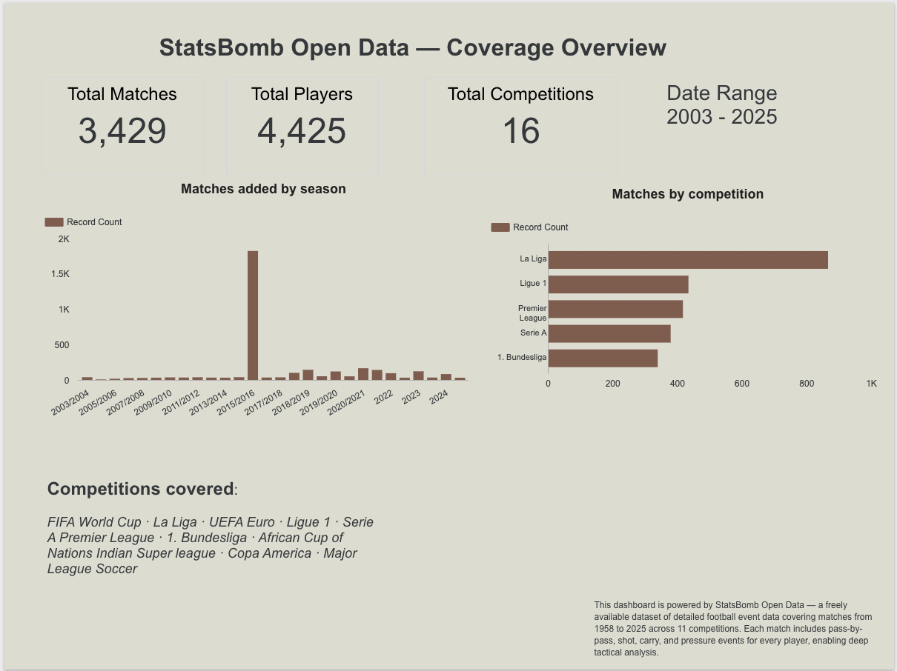
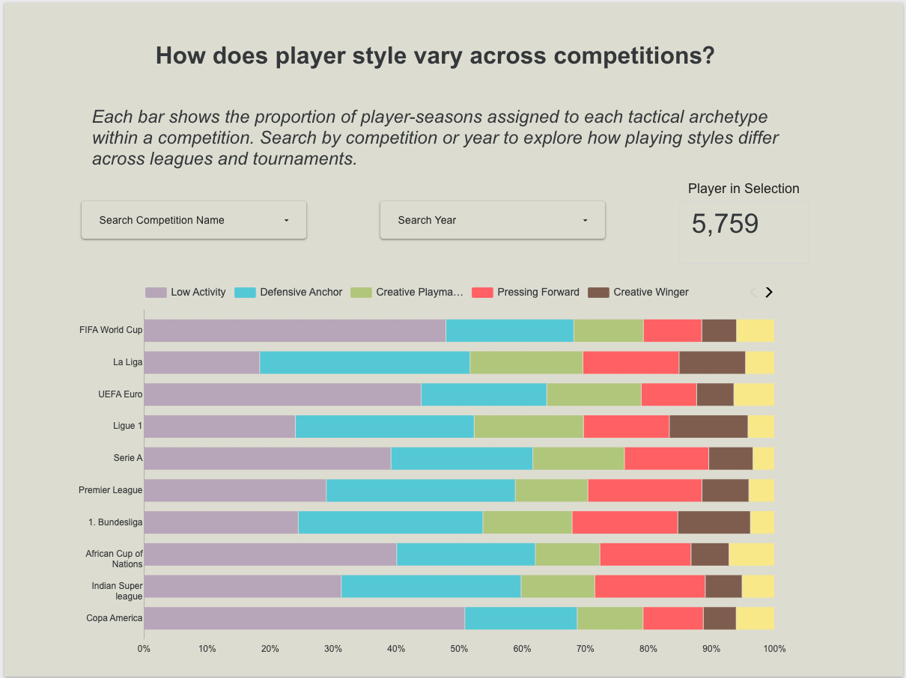
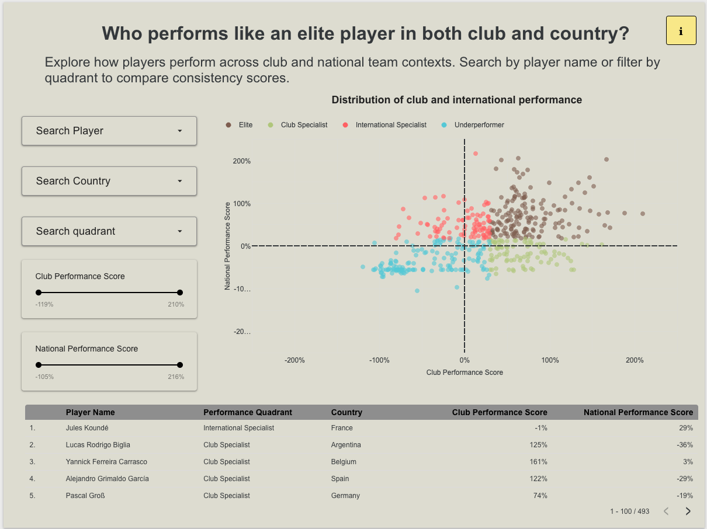
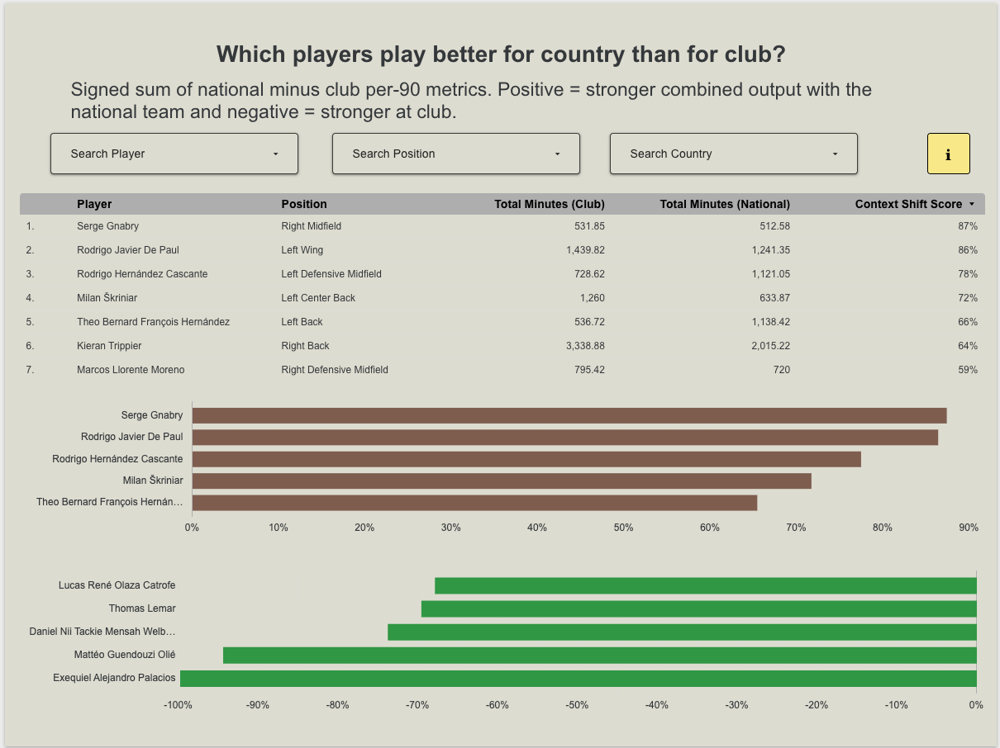

# Partner Handover Guide
# UBC MDS Soccer Capstone 2026 — Trilemma Foundation Football Analytics

> **Last updated:** June 2026
> **Outgoing team:** Quan Hoang, Li Pu, Teem Kwong, Rabin Duran
> **For questions contact:** quandothoang (GitHub)

---

## Table of Contents
1. [What This System Does](#1-what-this-system-does)
2. [Architecture Overview](#2-architecture-overview)
3. [Repository Structure](#3-repository-structure)
4. [Prerequisites](#4-prerequisites)
5. [GCP Setup (First Time Only)](#5-gcp-setup-first-time-only)
6. [Credentials & Environment Variables](#6-credentials--environment-variables)
7. [Development Environment Setup](#7-development-environment-setup)
8. [Running the Full Pipeline](#8-running-the-full-pipeline)
9. [Component Guides](#9-component-guides)
   - [9a. Data Ingestion](#9a-data-ingestion)
   - [9b. dbt Models](#9b-dbt-models)
   - [9c. Clustering (cluster.py)](#9c-clustering-clusterpy)
   - [9d. Consistency Scoring (consistency.py)](#9d-consistency-scoring-consistencypy)
   - [9e. Dagster Orchestration](#9e-dagster-orchestration)
   - [9f. Django Chatbot](#9f-django-chatbot)
   - [9g. Looker Studio Dashboard](#9g-looker-studio-dashboard)
   - [9h. Databricks Notebooks](#9h-databricks-notebooks)
10. [BigQuery Schema Reference](#10-bigquery-schema-reference)
11. [GitHub Actions CI Setup](#11-github-actions-ci-setup)
12. [How to Add New Data](#12-how-to-add-new-data)
13. [How to Maintain Each Component](#13-how-to-maintain-each-component)
14. [Troubleshooting](#14-troubleshooting)

---

## 1. What This System Does

This platform answers football analytics questions using StatsBomb open event data. It:

- **Ingests** StatsBomb match and event data into Google Cloud Storage and BigQuery
- **Transforms** raw data through a 3-layer dbt pipeline into analytics-ready mart tables
- **Clusters** players into 5 tactical archetypes (Creative Winger, Creative Playmaker, Defensive Anchor, Pressing Forward, Low Activity) using PCA + KMeans on 13 per-90 metrics
- **Scores** player consistency between club and international competition
- **Serves** results through two products:
  - A **Django LLM chatbot** (Groq + BigQuery) for natural language football analytics queries
  - A **Looker Studio dashboard** (12 pages) for match overview, player clusters, team comparisons, and consistency analysis

---

## 2. Architecture Overview

```
┌─────────────────────────────────────────────────────────────────┐
│                        DATA PIPELINE                            │
│                                                                 │
│  StatsBomb API (open data or paid — set SB_USERNAME/SB_PASSWORD)│
│      │                                                          │
│      ▼                                                          │
│  GCS ($INGESTION_GCS_BUCKET)                 ← ingestion        │
│  └── raw/statsbomb/{matches,events,lineups}/  ← Parquet files   │
│      │                                                          │
│      ▼                                                          │
│  BigQuery: $INGESTION_BQ_DATASET (default: raw_statsbomb)       │
│  └── matches, events, lineups (raw tables)                      │
│      │                                                          │
│      ▼  dbt run                                                 │
│  BigQuery: dbt_staging dataset                                  │
│  └── stg_statsbomb__matches                                     │
│  └── stg_statsbomb__events                                      │
│  └── stg_statsbomb__lineups                                     │
│      │                                                          │
│      ▼  dbt run                                                 │
│  BigQuery: $DBT_INTERMEDIATE_DATASET (default: dbt_intermediate)│
│  └── int_player_match_stats   (per-match player stats)          │
│  └── int_player_season_stats  (per-season player stats, men)    │
│  └── int_player_club_vs_national (club vs intl comparison)      │
│  └── int_match_stats          (per-match team stats, men)       │
│  └── int_team_season_stats    (per-season team stats)           │
│  └── int_team_rolling_form    (5-match rolling averages)        │
│      │                                                          │
│      ▼  Python ML scripts                                       │
│  BigQuery: $ML_BQ_DATASET (default: analytics)                  │
│  └── cluster_assignments  ← cluster.py output                   │
│  └── pca_loadings         ← cluster.py output                   │
│  └── consistency_scores   ← consistency.py output               │
│      │   (also written to gs://$ML_GCS_BUCKET/)                 │
│      ▼  dbt run                                                 │
│  BigQuery: dbt_marts dataset  ← PRODUCTS READ FROM HERE         │
│  └── mart_player_clusters     (player + archetype + per-90)     │
│  └── mart_player_performance  (player + archetype + consistency) │
│  └── mart_match_analysis      (match results + team metrics)    │
│  └── mart_team_comparison     (team season + rolling form)      │
│  └── mart_match_prediction_features (ML feature matrix)         │
└─────────────────────────────────────────────────────────────────┘

┌─────────────────────────────────────────────────────────────────┐
│                       ORCHESTRATION                             │
│                                                                 │
│  Dagster (port 3000)                                            │
│  Asset graph (in dependency order):                             │
│    raw_statsbomb                                                │
│      → football_analytics_dbt_assets  (staging + intermediate)  │
│        → cluster_assignments          (runs cluster.py)         │
│          → consistency_score          (runs consistency.py)     │
│            → dbt_mart_refresh         (refreshes marts)         │
│                                                                 │
│  Schedule: every Monday 6am UTC → full_pipeline_job (all assets)│
│  Sensor:   new GCS file → post_ingestion_job (dbt + ML + marts) │
└─────────────────────────────────────────────────────────────────┘

┌─────────────────────────────────────────────────────────────────┐
│                         PRODUCTS                                │
│                                                                 │
│  Django chatbot  (port 8000)                                    │
│  └── Groq LLM (llama-3.3-70b-versatile) + tool calling         │
│  └── Queries dbt_marts tables via BigQuery API                  │
│  └── Advanced Mode: shows SQL + raw data for debugging          │
│                                                                 │
│  Looker Studio dashboard (embedded in Django at /dashboard/)    │
│  └── 12 pages: match overview, clustering, team comparison,     │
│               consistency (5 pages), appendix (3)               │
│      Pages 1–4 read from dbt_marts (Dagster-automated).         │
│      Pages 5–9 read from analytics.* tables (notebook export).  │
└─────────────────────────────────────────────────────────────────┘
```

---

## 3. Repository Structure

```
.
├── app/                          # Django web application
│   ├── chatbot/                  # LLM chatbot app (Groq + BigQuery)
│   │   ├── llm_engine.py         # Core: tool-calling, SQL generation, BQ query
│   │   ├── table_schema.py       # Schema context fed to the LLM
│   │   ├── views.py              # HTMX request handler
│   │   └── templates/            # chat.html, chat_message.html
│   ├── dashboard/                # Looker Studio embed app
│   └── config/                   # Django settings, URLs, WSGI
│
├── models/                       # dbt models (SQL transformations)
│   ├── staging/                  # 1:1 mirror of raw BigQuery tables
│   ├── intermediate/             # Filtered, aggregated business logic
│   └── marts/                    # Analytics-ready final tables
│
├── seeds/                        # dbt seed files (static reference data)
│   ├── cluster_labels.csv        # Cluster ID → archetype label + description
│   └── competition_code_lookup.csv
│
├── src/
│   ├── dagster/                  # Dagster orchestration
│   │   ├── assets/
│   │   │   ├── ingestion.py      # raw_statsbomb, raw_polymarket assets
│   │   │   ├── dbt_assets.py     # dbt asset group
│   │   │   └── ml_assets.py      # cluster_assignments, consistency_score, dbt_mart_refresh
│   │   └── definitions.py        # Asset graph, jobs, schedules, sensors
│   │
│   └── ml/                       # ML pipeline scripts
│       ├── cluster.py            # PCA + KMeans clustering → BQ
│       └── consistency.py        # Club vs national consistency scoring → BQ
│
├── src/ingestion/                # Data ingestion scripts
│   ├── statsbomb.py              # Fetch StatsBomb data → local Parquet
│   ├── upload_gcs.py             # Upload local Parquet → GCS
│   └── load_bq.py                # Load GCS Parquet → BigQuery
│
├── notebooks/                    # Databricks analysis notebooks (full catalog: docs/notebooks.md)
│   ├── 01_data_exploration.py.ipynb
│   ├── 05_player_clustering.py.ipynb   # Li — clustering design (cluster.py source)
│   ├── 03_consistency_score.ipynb      # Rabin — consistency scoring (consistency.py source)
│   └── ...                             # see docs/notebooks.md for all 11 notebooks
│
├── docs/                         # Component documentation
│   ├── briefings/                # Per-person technical briefings
│   ├── notebooks.md              # Notebook catalog, run order, and export notes
│   ├── consistency.md
│   └── databricks_bigquery_setup.md
│
├── report/                       # Final report (Quarto)
│   └── final_report.qmd
│
├── tests/                        # Python unit tests
│   ├── test_cluster.py
│   └── test_consistency.py
│
├── .env.example                  # Template — copy to .env and fill in values
├── dbt_project.yml               # dbt project config
├── profiles.yml                  # dbt connection profile (BigQuery)
├── docker-compose.yml            # Runs django-env, jupyter-env, dagster-env
├── Dockerfile.django
├── Dockerfile.dagster
├── Dockerfile.jupyter
└── environment.yml               # Conda environment
```

---

## 4. Prerequisites

Install the following before doing anything else.

### Required software

| Tool | Version | Install |
|---|---|---|
| **conda** (Miniforge recommended) | ≥ 23.x | https://github.com/conda-forge/miniforge |
| **Docker Desktop** | ≥ 4.x | https://www.docker.com/products/docker-desktop |
| **Google Cloud SDK** (`gcloud`) | latest | https://cloud.google.com/sdk/docs/install |
| **Git** | ≥ 2.x | https://git-scm.com |

### Verify installations
```bash
conda --version          # conda 23.x.x
docker --version         # Docker version 24.x.x
gcloud --version         # Google Cloud SDK ...
git --version            # git version 2.x.x
```

### Accounts required
- **Google Cloud Platform** — access to the GCP project (get credentials from outgoing team)
- **Groq** — free API key at https://console.groq.com (takes 2 minutes)
- **StatsBomb** — no account needed for open data; contact StatsBomb if you need paid API access

---

## 5. GCP Setup (First Time Only)

> Skip this section if you received `dagster-service-account-key.json` and `chatbot-service-account-key.json` from the outgoing team and the GCP project already exists.

### 5a. Enable required APIs
In the [GCP Console](https://console.cloud.google.com) for your project, enable:
- BigQuery API
- Cloud Storage API
- IAM API

Or via CLI:
```bash
gcloud config set project YOUR_PROJECT_ID

gcloud services enable bigquery.googleapis.com \
  storage.googleapis.com \
  iam.googleapis.com
```

### 5b. Create GCS buckets
```bash
# Ingestion bucket (raw StatsBomb Parquet files)
gcloud storage buckets create gs://YOUR_INGESTION_BUCKET \
  --location=US --uniform-bucket-level-access

# ML outputs bucket (cluster assignments, consistency scores)
gcloud storage buckets create gs://YOUR_ML_BUCKET \
  --location=US --uniform-bucket-level-access
```

### 5c. Create BigQuery datasets
```bash
bq mk --dataset --location=US YOUR_PROJECT_ID:raw_statsbomb
bq mk --dataset --location=US YOUR_PROJECT_ID:dbt_staging
bq mk --dataset --location=US YOUR_PROJECT_ID:dbt_intermediate
bq mk --dataset --location=US YOUR_PROJECT_ID:dbt_marts
bq mk --dataset --location=US YOUR_PROJECT_ID:analytics
```

### 5d. Create service accounts and download the keys
```bash
# Create Dagster service account
gcloud iam service-accounts create dagster-sa \
  --display-name="Dagster Pipeline Service Account"

# Grant Dagster required roles
gcloud projects add-iam-policy-binding YOUR_PROJECT_ID \
  --member="serviceAccount:dagster-sa@YOUR_PROJECT_ID.iam.gserviceaccount.com" \
  --role="roles/bigquery.dataEditor"
gcloud projects add-iam-policy-binding YOUR_PROJECT_ID \
  --member="serviceAccount:dagster-sa@YOUR_PROJECT_ID.iam.gserviceaccount.com" \
  --role="roles/bigquery.jobUser"
gcloud projects add-iam-policy-binding YOUR_PROJECT_ID \
  --member="serviceAccount:dagster-sa@YOUR_PROJECT_ID.iam.gserviceaccount.com" \
  --role="roles/storage.admin"

# Create Chatbot service account
gcloud iam service-accounts create chatbot-sa \
  --display-name="Django Chatbot Service Account"

# Grant Chatbot required roles
gcloud projects add-iam-policy-binding YOUR_PROJECT_ID \
  --member="serviceAccount:chatbot-sa@YOUR_PROJECT_ID.iam.gserviceaccount.com" \
  --role="roles/bigquery.dataViewer"
gcloud projects add-iam-policy-binding YOUR_PROJECT_ID \
  --member="serviceAccount:chatbot-sa@YOUR_PROJECT_ID.iam.gserviceaccount.com" \
  --role="roles/bigquery.jobUser"

# Download the keys — place them in the project root
gcloud iam service-accounts keys create dagster-service-account-key.json \
  --iam-account=dagster-sa@YOUR_PROJECT_ID.iam.gserviceaccount.com
gcloud iam service-accounts keys create chatbot-service-account-key.json \
  --iam-account=chatbot-sa@YOUR_PROJECT_ID.iam.gserviceaccount.com
```

> ⚠️ **Never commit `service-account-key.json` to Git.** It is already in `.gitignore`.

---

## 6. Credentials & Environment Variables

### 6a. The `.env` file

Copy the template and fill in your values:
```bash
cp .env.example .env
```

Full list of variables (all required unless marked optional):

```bash
# ── GCP ──────────────────────────────────────────────────────────────────
GCP_PROJECT_ID=your-gcp-project-id
GOOGLE_APPLICATION_CREDENTIALS=./service-account-key.json

# ── GCS buckets ──────────────────────────────────────────────────────────
INGESTION_GCS_BUCKET=your-ingestion-bucket-name
ML_GCS_BUCKET=your-ml-bucket-name

# ── BigQuery datasets ─────────────────────────────────────────────────────
INGESTION_BQ_DATASET=raw_statsbomb        # dataset where raw tables are loaded
DBT_INTERMEDIATE_DATASET=dbt_intermediate  # dbt intermediate dataset name
ML_BQ_DATASET=analytics                   # ML script output dataset

# ── StatsBomb (optional) ──────────────────────────────────────────────────
# Leave blank to use free open data (GitHub-hosted, limited seasons).
# Fill in both to use the paid API (full historical coverage).
SB_USERNAME=
SB_PASSWORD=

# ── Groq LLM ─────────────────────────────────────────────────────────────
GROQ_API_KEY=your_groq_api_key_here       # get from https://console.groq.com

# ── Looker Studio ─────────────────────────────────────────────────────────
LOOKER_STUDIO_URL=https://lookerstudio.google.com/embed/reporting/00c26aba-1328-4c33-aa11-c3cff2b64c53/page/If9xF

# ── Django ────────────────────────────────────────────────────────────────
DJANGO_DEBUG=True
DJANGO_SECRET_KEY=change-me-in-production
```

### 6b. StatsBomb data access modes

The ingestion script (`src/ingestion/statsbomb.py`) detects credentials automatically:

| Mode | When | Coverage |
|---|---|---|
| **Open data** (default) | `SB_USERNAME`/`SB_PASSWORD` not set | Free, GitHub-hosted — limited seasons per competition |
| **Paid API** | Both `SB_USERNAME` and `SB_PASSWORD` set | Full historical coverage across all competitions |

A message is printed at startup:
```
StatsBomb: SB_USERNAME/SB_PASSWORD not set — using open data (free)
```
or
```
StatsBomb: using authenticated API (paid data)
```

### 6c. The `service-account-key.json` file

Place it in the project root. It is loaded via:
- `GOOGLE_APPLICATION_CREDENTIALS=./service-account-key.json` in `.env`
- `docker-compose.yml` mounts it into all containers automatically

```
UBC-MDS-Soccer-Capstone-2026/
├── service-account-key.json   ← here (never commit this)
├── .env                       ← here (never commit this)
└── ...
```

---

## 7. Development Environment Setup

### Option A — Conda (recommended for ML/dbt/notebook work)

```bash
# 1. Clone the repo
git clone https://github.com/TrilemmaFoundation/UBC-MDS-Soccer-Capstone-2026.git
cd UBC-MDS-Soccer-Capstone-2026

# 2. Create and activate the conda environment
conda env create -f environment.yml
conda activate soccer_capstone

# 3. Place credentials
cp .env.example .env
# Edit .env and fill in: GCP_PROJECT_ID, INGESTION_GCS_BUCKET, ML_GCS_BUCKET, GROQ_API_KEY
# (and optionally SB_USERNAME / SB_PASSWORD)

# 4. Place your GCP service account key
cp /path/to/service-account-key.json .

# 5. Export the credentials path for the current shell session
export GOOGLE_APPLICATION_CREDENTIALS=./service-account-key.json
```

#### Set up dbt connection profile

dbt needs a `~/.dbt/profiles.yml` to know how to connect to BigQuery. Create it:

```bash
mkdir -p ~/.dbt
cat > ~/.dbt/profiles.yml << 'EOF'
football_analytics:
  target: dev
  outputs:
    dev:
      type: bigquery
      method: service-account
      project: "{{ env_var('GCP_PROJECT_ID') }}"
      dataset: dbt_intermediate
      keyfile: "{{ env_var('GOOGLE_APPLICATION_CREDENTIALS') }}"
      threads: 4
      timeout_seconds: 300
      location: US
      priority: interactive
EOF
```

Then verify the connection:
```bash
dbt debug
# Should print: "All checks passed!"
```

#### Apply Django database migrations (first time only)

```bash
cd app
python manage.py migrate
cd ..
```

#### Verify the full setup

```bash
# Test BigQuery access
python -c "from google.cloud import bigquery; c = bigquery.Client(); print('BQ OK')"

# Test dbt connection
dbt debug

# Test Groq API key
python -c "
from groq import Groq
import os
Groq(api_key=os.getenv('GROQ_API_KEY')).chat.completions.create(
    model='llama-3.3-70b-versatile',
    messages=[{'role':'user','content':'ping'}]
)
print('Groq OK')
"

# Test StatsBomb open data access
conda run -n soccer_capstone python -c "
from statsbombpy import sb
import warnings; warnings.filterwarnings('ignore')
comps = sb.competitions()
print(f'StatsBomb OK — {len(comps)} competition-seasons available')
"
```

---

### Option B — Docker (recommended for running the full application stack)

Docker runs all three services (Django, Dagster, Jupyter) in containers without needing to manage Python environments manually.

```bash
# 1. Clone the repo
git clone https://github.com/TrilemmaFoundation/UBC-MDS-Soccer-Capstone-2026.git
cd UBC-MDS-Soccer-Capstone-2026

# 2. Set up credentials
cp .env.example .env
# Edit .env — fill in all required values (see Section 6a)
cp /path/to/service-account-key.json .

# 3. Build images (first time only — takes 5-10 min)
docker compose build

# 4. Apply Django migrations (first time only)
docker compose run --rm django-env python manage.py migrate

# 5. Start all services
docker compose up
```

Docker exposes:
| URL | Service |
|---|---|
| `http://localhost:8000` | Django chatbot + dashboard |
| `http://localhost:3000` | Dagster orchestration UI |
| `http://localhost:8888` | Jupyter notebooks |

To start a single service:
```bash
docker compose up django-env        # chatbot only
docker compose up dagster-env       # pipeline UI only
docker compose up jupyter-env       # notebooks only
```

To rebuild after code changes:
```bash
docker compose build django-env && docker compose up django-env
```

---

## 8. Running the Full Pipeline

### First-time run checklist

Before running the pipeline for the first time, confirm:
- [ ] `.env` is populated with all required variables
- [ ] `service-account-key.json` is in the project root
- [ ] GCP BigQuery datasets exist (`raw_statsbomb`, `dbt_staging`, `dbt_intermediate`, `dbt_marts`, `analytics`) — see Section 5c
- [ ] GCS buckets exist — see Section 5b
- [ ] `dbt debug` passes
- [ ] `dbt deps` has been run to install dbt packages

```bash
# Install dbt packages (first time only)
dbt deps
```

### Automated (Dagster — recommended)

```bash
# Start Dagster
conda activate soccer_capstone
dagster dev -f src/dagster/definitions.py

# Then open http://localhost:3000
# → Assets → Select All → Materialize All
```

The weekly schedule runs automatically every Monday at 6am UTC (`full_pipeline_job`).
The GCS sensor checks `raw/statsbomb/matches/` hourly and triggers `post_ingestion_job` (dbt + ML + mart refresh, no re-ingestion) when new files appear.

### Manual (step-by-step)

Run these in order if Dagster is unavailable:

```bash
# Step 1: Ingest StatsBomb data → local Parquet → GCS → BigQuery
python src/ingestion/statsbomb.py    # ~10–30 min; saves to data/parquet/
python src/ingestion/upload_gcs.py   # upload to GCS $INGESTION_GCS_BUCKET
python src/ingestion/load_bq.py      # load from GCS into BigQuery $INGESTION_BQ_DATASET

# Step 2: Run dbt (staging + intermediate layers)
dbt seed                             # load cluster_labels.csv and other seeds
dbt run --select staging intermediate

# Step 3: Train clustering model
python src/ml/cluster.py
# Outputs: analytics.cluster_assignments, analytics.pca_loadings

# Step 4: Run consistency scoring (needs pca_loadings from Step 3)
python src/ml/consistency.py
# Output: analytics.consistency_scores

# Step 5: Refresh dbt marts (picks up new ML outputs)
dbt run --select mart_player_clusters mart_player_performance

# Step 6: Refresh remaining marts
dbt run --select mart_match_analysis mart_team_comparison mart_match_prediction_features

# Step 7: Run dbt tests to verify everything
dbt test
```

### Expected row counts after a successful run

| Table | Expected rows | Notes |
|---|---|---|
| `dbt_intermediate.int_player_season_stats` | ~5,800 | Men's competitions only |
| `dbt_intermediate.int_player_club_vs_national` | ~979 | Players with 270+ min in BOTH club and international |
| `dbt_intermediate.int_match_stats` | ~5,800 | Men's matches only |
| `analytics.cluster_assignments` | ~5,800 | One row per player-season (incl. GKs at cluster=-1) |
| `analytics.pca_loadings` | 13 × n_components (~78) | Long format |
| `analytics.consistency_scores` | ~979 | One row per player |
| `dbt_marts.mart_player_clusters` | ~5,800 | No duplicate player-seasons |
| `dbt_marts.mart_player_performance` | ~5,800 | One row per player-season |

---

## 9. Component Guides

### 9a. Data Ingestion

**Files:** `src/ingestion/statsbomb.py`, `src/ingestion/upload_gcs.py`, `src/ingestion/load_bq.py`
**Dagster asset:** `src/dagster/assets/ingestion.py` → `raw_statsbomb`

The ingestion pipeline runs 3 steps in sequence:

1. **`statsbomb.py`** — Fetches matches, events, and lineups from the StatsBomb Python library and saves Parquet files to `data/parquet/` locally
2. **`upload_gcs.py`** — Uploads those Parquet files to `gs://$INGESTION_GCS_BUCKET/raw/statsbomb/{matches,events,lineups}/`
3. **`load_bq.py`** — Loads from GCS into BigQuery `$INGESTION_BQ_DATASET.{matches,events,lineups}` using `WRITE_TRUNCATE` (safe to re-run)

**StatsBomb data modes:** See Section 6b. No credentials = free open data (limited seasons). With `SB_USERNAME` + `SB_PASSWORD` = full paid API.

**Competition names are case-sensitive.** They must exactly match what StatsBomb's API returns. To check available names:
```python
from statsbombpy import sb
import warnings; warnings.filterwarnings('ignore')
print(sorted(sb.competitions()['competition_name'].unique().tolist()))
```

**To add a new competition or season:**
1. Verify the exact name in the output above
2. Add it to `TARGET_COMPETITIONS` in `src/ingestion/statsbomb.py`
3. Re-run the `raw_statsbomb` Dagster asset (or run the 3 scripts manually)

**`raw_polymarket`:** No automated ingestion script. Upload Parquet files manually to GCS and load to BigQuery `raw_polymarket` before running downstream models.

**GCS structure:**
```
gs://$INGESTION_GCS_BUCKET/
└── raw/statsbomb/
    ├── matches/YYYY-MM-DD/matches.parquet
    ├── events/YYYY-MM-DD/events.parquet
    └── lineups/YYYY-MM-DD/lineups.parquet

gs://$ML_GCS_BUCKET/
└── models/
    ├── clustering/cluster_assignments.parquet
    ├── clustering/pca_loadings.parquet
    └── consistency/consistency_scores.parquet
```

---

### 9b. dbt Models

**Config file:** `dbt_project.yml`
**Models:** `models/` directory
**Seeds:** `seeds/` directory (static reference data — loaded with `dbt seed`)
**Tests + schema:** `models/*/schema.yml`
**Profile:** `~/.dbt/profiles.yml` (created in Section 7)

#### Layer conventions

| Layer | Dataset | Rule |
|---|---|---|
| Staging | `dbt_staging` | 1:1 mirror of raw. Type casts only, no business logic. Never filter rows. |
| Intermediate | `dbt_intermediate` | Business logic, aggregation. **Filter `WHERE m.gender = 'male'`** to scope to men's football. |
| Marts | `dbt_marts` | Analytics-ready. Join ML outputs from `analytics` dataset. |

#### Key design decisions
- **270-minute threshold:** All player-level models filter `HAVING SUM(minutes_played) >= 270` for statistical stability.
- **Gender filter at intermediate layer:** Staging stays neutral. Women's analysis would require separate intermediate models.
- **`SAFE_DIVIDE`:** Used everywhere instead of `/` to avoid division-by-zero errors.
- **Mart join grain:** `mart_player_clusters` and `mart_player_performance` join on `(player_id, competition_id, season_id)` — not just `player_id` — to prevent fan-out (duplicate rows per player).

#### Running dbt

```bash
conda activate soccer_capstone

dbt deps                                    # install packages (first time only)
dbt seed                                    # load seeds/cluster_labels.csv etc.
dbt run                                     # run all models
dbt run --select staging                    # run one layer only
dbt run --select +mart_player_clusters      # run model + all its dependencies
dbt test                                    # run all schema tests
dbt docs generate && dbt docs serve         # view lineage graph in browser (localhost:8080)
```

---

### 9c. Clustering (cluster.py)

**File:** `src/ml/cluster.py`
**Source:** `dbt_intermediate.int_player_season_stats` (men's only, 270+ min)
**Output:** `analytics.cluster_assignments`, `analytics.pca_loadings` (also written to GCS)

#### What it does
1. Fetches 13 per-90 features + `position_name` for each player-season from BigQuery
2. **Excludes Goalkeepers** before clustering — GKs are assigned `cluster=-1` and `archetype='Goalkeeper'` directly from position data
3. Median imputation for nulls → 99th-percentile outlier clipping → StandardScaler
4. PCA: uses enough components to explain ≥80% variance (typically 6 components)
5. KMeans with k=5 → assigns each outfield player-season to a cluster
6. Maps cluster IDs to archetype labels via `CLUSTER_LABELS` dict in `cluster.py`
7. Re-attaches GK rows with `cluster=-1`, `archetype='Goalkeeper'`, `pc1/pc2=NaN`
8. Exports combined `cluster_assignments` and `pca_loadings` to BigQuery + GCS

#### ⚠️ Important: cluster label recalibration after re-training

KMeans cluster IDs (0–4) are assigned arbitrarily each run. After any re-training, you **must** verify the `CLUSTER_LABELS` mapping is still correct by inspecting cluster centroids:

```sql
-- Run in BigQuery after cluster.py completes
-- Replace YOUR_PROJECT_ID with your GCP project ID
SELECT
    c.cluster,
    COUNT(*) AS n_players,
    ROUND(AVG(s.xg_per_90), 3)            AS xg_per_90,
    ROUND(AVG(s.shots_per_90), 3)         AS shots_per_90,
    ROUND(AVG(s.passes_per_90), 3)        AS passes_per_90,
    ROUND(AVG(s.dribbles_per_90), 3)      AS dribbles_per_90,
    ROUND(AVG(s.interceptions_per_90), 3) AS interceptions_per_90,
    ROUND(AVG(s.clearances_per_90), 3)    AS clearances_per_90
FROM `YOUR_PROJECT_ID.analytics.cluster_assignments` c
JOIN `YOUR_PROJECT_ID.dbt_intermediate.int_player_season_stats` s
  ON  c.player_id = s.player_id
  AND c.competition_id = s.competition_id
  AND c.season_id = s.season_id
WHERE c.cluster >= 0
GROUP BY c.cluster
ORDER BY c.cluster
```

Then update `CLUSTER_LABELS` in `cluster.py` AND `seeds/cluster_labels.csv` based on the profiles:
- High `xg_per_90` + `shots_per_90` + `dribbles_per_90` → **Creative Winger**
- High `passes_per_90` + `pass_completion_pct` → **Creative Playmaker**
- High `interceptions_per_90` + `clearances_per_90` → **Defensive Anchor**
- High `pressures_per_90` + `shots_per_90` → **Pressing Forward**
- Low everything → **Low Activity**

After updating, re-run:
```bash
dbt seed   # reload cluster_labels.csv
dbt run --select mart_player_clusters mart_player_performance
```

#### The 13 PCA features (must match Li's notebook)
`xg_per_90, shots_per_90, passes_per_90, passes_att_third_per_90, pressures_per_90, carries_per_90, dribbles_per_90, interceptions_per_90, blocks_per_90, clearances_per_90, duels_per_90, xg_per_shot, pass_completion_pct`

---

### 9d. Consistency Scoring (consistency.py)

**File:** `src/ml/consistency.py`
**Source:** `dbt_intermediate.int_player_club_vs_national` (players with 270+ min in BOTH contexts)
**Source (weights):** `analytics.pca_loadings` (from cluster.py — **must run cluster.py first**)
**Output:** `analytics.consistency_scores`

#### What it does
1. Reads z-scored per-90 metrics for each player in both club and international context
2. Uses PCA loadings as feature weights
3. Computes weighted performance scores for club and international contexts
4. `consistency_score = 1 - mean(|z_club - z_national|)` across 13 features
5. Assigns `performance_quadrant` based on median splits:
   - **Elite**: above median in both club and national performance
   - **Club Specialist**: above club median, below national median
   - **International Specialist**: below club median, above national median
   - **Underperformer**: below median in both contexts

#### Running

```bash
# Must run AFTER cluster.py (needs analytics.pca_loadings as feature weights)
python src/ml/consistency.py
```

---

### 9e. Dagster Orchestration

**Files:** `src/dagster/definitions.py`, `src/dagster/assets/`

#### Starting Dagster

```bash
conda activate soccer_capstone
dagster dev -f src/dagster/definitions.py
# UI at http://localhost:3000
```

#### Asset graph (dependency order)

```
raw_statsbomb          (ingestion: statsbomb.py → upload_gcs.py → load_bq.py)
raw_polymarket         (stub — manual upload required, no automated script)
    ↓
football_analytics_dbt_assets  (runs all staging + intermediate dbt models)
    ↓
cluster_assignments    (runs src/ml/cluster.py)
    ↓
consistency_score      (runs src/ml/consistency.py)
    ↓
dbt_mart_refresh       (dbt run mart_player_clusters mart_player_performance)
```

#### Jobs

| Job | What it runs | Triggered by |
|---|---|---|
| `full_pipeline_job` | All assets (ingestion → dbt → ML → marts) | Weekly schedule, manual |
| `post_ingestion_job` | dbt + ML + marts only (no ingestion) | GCS sensor |

#### Schedule and sensor
- **Weekly schedule:** Every Monday 6am UTC → `full_pipeline_job`
- **GCS sensor:** Checks `gs://$INGESTION_GCS_BUCKET/raw/statsbomb/matches/` hourly → triggers `post_ingestion_job` when new files appear. Does **not** re-run ingestion to avoid an infinite trigger loop.

#### Adding a new asset

```python
# In src/dagster/assets/ml_assets.py
@asset(
    group_name="ml",
    deps=[AssetKey(["cluster_assignments"])],
)
def my_new_asset():
    result = subprocess.run(
        ["python", "src/ml/my_script.py"],
        capture_output=True, text=True
    )
    if result.returncode != 0:
        raise Exception(result.stderr)
    return Output(value=None, metadata={"stdout": MetadataValue.text(result.stdout)})
```

Then register it in `src/dagster/definitions.py`:
```python
defs = Definitions(assets=[..., my_new_asset], ...)
```

---

### 9f. Django Chatbot

**Directory:** `app/`

#### Running locally (without Docker)

```bash
conda activate soccer_capstone
cd app
python manage.py migrate    # first time only
python manage.py runserver
# Visit http://localhost:8000
```

#### Running with Docker

```bash
docker compose up django-env
# Visit http://localhost:8000
```

#### How the chatbot works
1. User submits a natural language question via the web UI
2. `views.py` calls `ask_football_chatbot()` in `llm_engine.py`
3. Groq LLM (`llama-3.3-70b-versatile`) generates a BigQuery SQL query using tool-calling
4. `query_bigquery()` validates the SQL (blocks non-SELECT statements) and executes it against `dbt_marts`
5. A data-presence check ensures the LLM formats the results; `_format_fallback()` catches cases where the LLM omits data
6. Response rendered via HTMX into `chat_message.html`

#### Updating the chatbot to support new tables or columns
Edit `app/chatbot/table_schema.py` — this is the schema context fed to the LLM. Add new tables or columns following the existing format.

#### Updating the system prompt
Edit `llm_engine.py` — the `CRITICAL RULES` section in the system prompt. Keep rules numbered and specific.

#### Advanced Mode
Checkbox in the UI that shows the executed SQL and raw BigQuery JSON for debugging. Use this first when a response looks wrong.

#### Security
- `is_safe_sql()` blocks all non-SELECT statements (DROP, DELETE, INSERT, etc.)
- 200 MB BigQuery bytes-billed limit per query
- Query cache enabled to reduce costs

---

### 9g. Looker Studio Dashboard

**URL:** https://lookerstudio.google.com/reporting/00c26aba-1328-4c33-aa11-c3cff2b64c53
**Embedded at:** `/dashboard/` in the Django app (iframe via `LOOKER_STUDIO_URL` in `.env`)

The dashboard has **12 pages** (4 match/clustering pages, 5 consistency pages, 3 methodology appendix pages).

#### Data sources and refresh

Not every page is fed by Dagster. Know which tables refresh automatically vs which need a manual notebook export:

| Refresh | BigQuery location | How it is populated |
|---|---|---|
| **Automated** (Dagster / dbt / ML) | `dbt_marts.*` | `raw_statsbomb` → dbt → `cluster.py` → `consistency.py` → `dbt_mart_refresh` |
| **Automated** (ML only) | `analytics.consistency_scores` | `consistency.py` (also joined into `mart_player_performance`) |
| **Manual export** | `analytics.consistency_national_team` | Notebook-derived table for national-team consistency views — re-export after pipeline changes |
| **Manual export** | `analytics.player_club_nat_blend` | Notebook-derived blend table for anomaly detection — re-export after pipeline changes |
| **Manual export** | `analytics.player_ctx` | Export cell in `Data Validation & research question 3.ipynb` — player × Club/National per-90 comparison |

> **Important:** Pages 5–9 will **not** update when you run Dagster alone. After re-running the pipeline, re-export the `analytics.*` tables above from the relevant notebooks (see `docs/notebooks.md`). Pages 1–4 and the chatbot stay current via Dagster.

Formula definitions for consistency pages are in `docs/appendix/`.

#### Dashboard pages (all 12)

| Page | Tab Name | Key Question / Title | Primary Source Table(s) | Refresh |
|------|----------|----------------------|-------------------------|---------|
| 1  | Match Overview            | StatsBomb Open Data — Coverage Overview                               | `dbt_marts.mart_match_analysis`, `dbt_marts.mart_player_clusters` | Dagster |
| 2  | Competition Breakdown     | How does player style vary across competitions?                       | `dbt_marts.mart_player_clusters` | Dagster |
| 3  | Player Archetype Explorer | How are players distributed across tactical archetypes over seasons?  | `dbt_marts.mart_player_clusters` | Dagster |
| 4  | Team Comparison           | How did team performance vary across seasons? / head-to-head          | `dbt_marts.mart_team_comparison`, `dbt_marts.mart_match_analysis` | Dagster |
| 5  | International Overview    | Who is in our club vs national analysis?                              | `analytics.consistency_national_team` | Notebook export |
| 6  | Consistency Explorer      | Who performs like an elite player in both club and country?           | `analytics.consistency_national_team` | Notebook export |
| 7  | National Team Explorer    | Which countries' players perform best nationally?                     | `analytics.consistency_national_team` | Notebook export |
| 8  | Anomaly Detection         | Which players play better for country than for club?                  | `analytics.player_club_nat_blend` | Notebook export |
| 9  | Club vs International     | Club vs National Player Performance (per-90 metric comparison)        | `analytics.player_ctx` | Notebook export |
| 10 | Appendix                  | Methods and Formulas — Context Shift Score                            | — (static) | — |
| 11 | Appendix Part 2           | Methods and Formulas — Consistency Explorer                           | — (static) | — |
| 12 | Appendix Part 3           | Methodology — How Players Are Clustered (PCA + K-Means)              | — (static) | — |

#### Visual preview (selected pages)

Screenshots below show four representative pages. All 12 page captures live in `results/dashboard/` (files named `01_match_overview.png` … `12_appendix_clustering.png`).

**Page 1 — Match Overview** · *Refresh: Dagster*  
Coverage scorecards (matches, players, competitions, date range), matches-by-season and matches-by-competition charts.  
*Source:* `dbt_marts.mart_match_analysis`, `dbt_marts.mart_player_clusters`



**Page 2 — Competition Breakdown** · *Refresh: Dagster*  
100% stacked bars showing archetype mix per competition (La Liga, Premier League, World Cup, etc.); filter by competition or year.  
*Source:* `dbt_marts.mart_player_clusters`



**Page 6 — Consistency Explorer** · *Refresh: Notebook export*  
Quadrant scatter (Elite / Club Specialist / International Specialist / Underperformer) with player search and performance-score filters.  
*Source:* `analytics.consistency_national_team`



**Page 8 — Anomaly Detection** · *Refresh: Notebook export*  
Context Shift Score table and top/bottom bar charts — players who perform better for country vs club (signed sum of national minus club per-90 metrics).  
*Source:* `analytics.player_club_nat_blend`



---

### 9h. Databricks Notebooks

**Directory:** `notebooks/`
**Full catalog and run order:** `docs/notebooks.md`
**Setup guide:** `docs/databricks_bigquery_setup.md`

Databricks was used during development for EDA and to develop the ML pipeline before it was productionised. The notebooks are the **source of truth** for ML methodology; production code lives in `src/ml/`.

#### Key notebooks (production lineage)

| Notebook | Author | Purpose |
|---|---|---|
| `05_player_clustering.py.ipynb` | Li | PCA + KMeans development. Defines the 13 features, preprocessing steps, and archetype labelling. `cluster.py` is derived from this. |
| `03_consistency_score.ipynb` | Rabin | Club vs national consistency scoring development. `consistency.py` is derived from this. |
| `Data Validation & research question 3.ipynb` | Rabin | RQ3 validation; exports `analytics.player_ctx` for Looker page 9 |

#### Full notebook catalog

| Notebook | Topic | Main outputs |
|---|---|---|
| `01_data_exploration.py.ipynb` | EDA | Summary stats, plots (display only) |
| `02_feature_engineering.py.ipynb` | RQ2 features | Engineered feature tables (Databricks) |
| `03_consistency_score.ipynb` | Consistency formula | `analytics.consistency_scores` (optional export; production uses `consistency.py`) |
| `04_feature_importance.ipynb` | Specialist analysis | Feature-importance plots (display only) |
| `05_player_clustering.py.ipynb` | Clustering design | k selection, archetype notes → `cluster.py` |
| `06_export_artifacts.py.ipynb` | Artifacts | GCS / Delta exports (check notebook cells) |
| `07_rq1_role_distribution.py.ipynb` | RQ1 report | Chi-square tables, heatmaps → `report/final_report.qmd` |
| `08_rq3_four_quadrant_consistency.py.ipynb` | RQ3 report | Quadrant tables, scatter plots → `report/final_report.qmd` |
| `player_clustering.ipynb` | Legacy / local | Local clustering experiments |
| `player_profiles_international_eda.ipynb` | International EDA | EDA plots (display only) |
| `Data Validation & research question 3.ipynb` | RQ3 validation | `analytics.player_ctx` export for Looker |

See `docs/notebooks.md` for recommended run order, BigQuery table paths, and troubleshooting.

#### Accessing Databricks Community Edition
1. Go to https://community.cloud.databricks.com
2. Log in with team credentials (get from outgoing team)
3. Navigate to Workspace → Shared → notebooks

#### Connecting Databricks to BigQuery
See `docs/databricks_bigquery_setup.md` for the full setup. Summary:
1. Upload `service-account-key.json` to Databricks File System (DBFS)
2. Install `google-cloud-bigquery` and `db-dtypes` via cluster libraries
3. Authenticate:
```python
from google.oauth2 import service_account
from google.cloud import bigquery
import os

credentials = service_account.Credentials.from_service_account_file(
    "/dbfs/path/to/service-account-key.json"
)
client = bigquery.Client(
    project=os.getenv("GCP_PROJECT_ID"),
    credentials=credentials
)
```

#### Running notebooks locally (Jupyter)
```bash
docker compose up jupyter-env
# Visit http://localhost:8888
```

#### Important: notebook vs production code
The notebooks contain exploratory code. The **production versions** are `src/ml/cluster.py` and `src/ml/consistency.py`. If you change the ML methodology, update both the notebook (for documentation) and the production script.

---

## 10. BigQuery Schema Reference

### `dbt_marts.mart_player_clusters`
One row per player-season. Join grain: `(player_id, competition_id, season_id)`.

| Column | Type | Description |
|---|---|---|
| `player_id` | INT64 | StatsBomb player identifier |
| `player_name` | STRING | Player display name |
| `competition_id` | INT64 | Competition identifier |
| `competition_name` | STRING | e.g. "La Liga", "World Cup" |
| `season_id` | INT64 | Season identifier |
| `season_name` | STRING | e.g. "2020/2021" |
| `total_minutes` | FLOAT64 | Total minutes played in this season |
| `cluster_id` | INT64 | KMeans cluster index (0–4). -1 for Goalkeepers. |
| `cluster_label` | STRING | Archetype: Goalkeeper / Low Activity / Creative Winger / Creative Playmaker / Defensive Anchor / Pressing Forward |
| `pc1`, `pc2` | FLOAT64 | PCA coordinates for 2D scatter plot. NULL for Goalkeepers. |
| `xg_per_90` … `pass_completion_pct` | FLOAT64 | All 13 PCA input features (per-90) |
| `goals_per_90`, `assists_per_90` | FLOAT64 | Supplementary traditional metrics |

### `dbt_marts.mart_player_performance`
All columns from `mart_player_clusters`, plus:

| Column | Type | Description |
|---|---|---|
| `total_goals` … `total_aerial_duels` | INT64 | Raw season totals |
| `club_performance_score` | FLOAT64 | Weighted PCA performance score at club level |
| `national_performance_score` | FLOAT64 | Weighted PCA performance score at national level |
| `consistency_score` | FLOAT64 | 1 − mean(|z_club − z_national|). Higher = more consistent. NULL for players without 270+ min in both contexts. |
| `performance_quadrant` | STRING | Elite / Club Specialist / International Specialist / Underperformer |

### `dbt_marts.mart_match_analysis`
One row per match. Contains match results, xG, possession proxy, shots, pressures.

### `dbt_marts.mart_team_comparison`
One row per team-season (campaigns with ≥10 matches). Contains seasonal baseline + 5-match rolling form.

### `analytics.cluster_assignments`
One row per player-season. Written by `cluster.py`. Includes GKs with `cluster=-1`.

### `analytics.pca_loadings`
Long format: one row per `(component, feature)` pair (13 features × n_components rows). `n_components` is chosen dynamically by `cluster.py` to explain ≥80% variance (typically ~6, so ~78 rows). Columns: `component`, `feature`, `loading`. Used by `consistency.py` as feature weights.

### `analytics.consistency_scores`
One row per player (only players with 270+ min in BOTH club and international contexts). Written by `consistency.py`.

---

## 11. GitHub Actions CI Setup

The repository has a dbt CI workflow (`.github/workflows/dbt_test.yml`) that runs on every PR touching `models/`. It requires two secrets/variables to be configured in GitHub:

### Required GitHub repository variable
1. Go to **Settings → Secrets and variables → Actions → Variables tab**
2. Click **New repository variable**
3. Name: `GCP_PROJECT_ID`, Value: your GCP project ID

### Required GitHub secret
1. Go to **Settings → Secrets and variables → Actions → Secrets tab**
2. Click **New repository secret**
3. Name: `GCE_SERVICE_ACCOUNT_KEY`
4. Value: the **entire contents** of `service-account-key.json` (copy-paste the JSON)

### What the CI workflow does
On every PR that touches `models/`, `macros/`, or `dbt_project.yml`:
1. Authenticates with GCP using `GCE_SERVICE_ACCOUNT_KEY`
2. Creates a temporary BigQuery dataset `pr_validation_{PR_NUMBER}`
3. Runs `dbt run --select staging intermediate`
4. Runs `dbt test --select staging intermediate`
5. Drops the temporary dataset (always, even if tests fail)

---

## 12. How to Add New Data

### New StatsBomb season or competition
1. Check availability and exact name:
   ```python
   from statsbombpy import sb
   import warnings; warnings.filterwarnings('ignore')
   comps = sb.competitions()
   print(comps[comps['competition_gender'] == 'male']['competition_name'].unique())
   ```
2. Add the exact name to `TARGET_COMPETITIONS` in `src/ingestion/statsbomb.py`
3. Re-run the `raw_statsbomb` Dagster asset (or run the 3 scripts manually)
4. Re-run the full pipeline (dbt → cluster.py → consistency.py → dbt marts)
5. **Re-verify cluster labels** — new data changes KMeans centroids (see §9c)

### New metric
1. Extract the raw value in `models/staging/stg_statsbomb__events.sql`
2. Aggregate it in `models/intermediate/int_player_match_stats.sql`
3. Sum and expose as per-90 in `models/intermediate/int_player_season_stats.sql`
4. Add to mart columns in `mart_player_clusters.sql` and/or `mart_player_performance.sql`
5. If adding to clustering: add to `FEATURES` list in `cluster.py` AND update Li's notebook (`05_player_clustering.py.ipynb`)
6. Update `app/chatbot/table_schema.py` so the LLM knows about the new column

### Women's football
The current pipeline filters to men's competitions at the intermediate layer (`WHERE m.gender = 'male'`). To add women's football:
1. Create parallel intermediate models (e.g. `int_player_season_stats_women.sql`) without the gender filter
2. Create separate mart models
3. Add new Dagster assets and dbt models to the pipeline
4. Do not remove the gender filter from existing intermediate models (it scopes the current clustering)

---

## 13. How to Maintain Each Component

### Re-training clusters after new data
```bash
python src/ml/cluster.py
# IMPORTANT: re-verify cluster labels after re-training (see §9c)
# Update CLUSTER_LABELS in cluster.py AND seeds/cluster_labels.csv
dbt seed   # reload cluster_labels.csv into BigQuery
dbt run --select mart_player_clusters mart_player_performance
```

### Updating the chatbot for new archetypes or tables
1. Edit `app/chatbot/table_schema.py` — add new columns/tables to `TABLE_CONTEXT`
2. If new cluster labels: update the `cluster_label` values in `table_schema.py`
3. Restart the Django server (or Docker container): `docker compose restart django-env`

### Updating dbt models
```bash
# After editing a .sql file
dbt run --select <model_name>+   # + also runs downstream dependents
dbt test --select <model_name>
```

### Adding a new Looker Studio page
1. Open the dashboard in Looker Studio edit mode
2. Add a new page and connect it to the relevant BigQuery table:
   - Pipeline-fed pages → `dbt_marts.*` (refreshed by Dagster)
   - Consistency deep-dive pages → `analytics.*` (may require a notebook export first — see §9g)
3. The Django embed at `/dashboard/` will automatically show the new page (iframe)

### Rotating GCP credentials
1. Create a new service account key in GCP IAM
2. Download and replace `service-account-key.json` in the project root
3. Update `GCE_SERVICE_ACCOUNT_KEY` in GitHub Actions secrets
4. Rebuild Docker containers: `docker compose build`

---

## 14. Troubleshooting

### "StatsBomb ingestion failed — No objects to concatenate"
**Cause:** `statsbomb.py` fetched no matches — either all API calls failed or the competition names don't match the API.
**Fix:**
1. Run `statsbomb.py` directly to see the actual error: `python src/ingestion/statsbomb.py`
2. The script now prints a clear error with a list of available competition names if the filter returns zero results
3. Check that all names in `TARGET_COMPETITIONS` exactly match StatsBomb's API (case-sensitive — e.g. `"Indian Super league"` not `"Indian Super League"`)
4. If using paid credentials, verify `SB_USERNAME` and `SB_PASSWORD` are set in `.env`

### "NoAuthWarning: credentials were not supplied. open data access only"
**Cause:** `SB_USERNAME`/`SB_PASSWORD` are not set in `.env`. This is **expected and not an error** when using open data.
**Fix:** If you want paid data, set both `SB_USERNAME` and `SB_PASSWORD` in `.env`. Otherwise, ignore the warning.

### "DefaultCredentialsError" or "Could not automatically determine credentials"
**Cause:** `GOOGLE_APPLICATION_CREDENTIALS` is not set or points to a missing file.
**Fix:**
```bash
export GOOGLE_APPLICATION_CREDENTIALS=./service-account-key.json
# Then verify:
python -c "from google.cloud import bigquery; bigquery.Client(); print('OK')"
```

### "dbt debug fails — project not found" or "dataset not found"
**Cause:** `~/.dbt/profiles.yml` is missing, wrong, or pointing to a non-existent BigQuery dataset.
**Fix:**
1. Verify profiles.yml exists: `cat ~/.dbt/profiles.yml`
2. Verify the BigQuery datasets exist: `bq ls YOUR_PROJECT_ID:`
3. Create any missing datasets (see Section 5c)
4. Re-run `dbt debug`

### "Chatbot shows 'Query executed with precision.' with no data"
**Cause:** LLM response did not format the data rows.
**Fix:** The `_response_contains_data()` fallback in `llm_engine.py` should catch this automatically. If it persists, check `PRIMARY_MODEL = "llama-3.3-70b-versatile"` in `llm_engine.py`.

### "Same player appears twice in chatbot results"
**Cause:** LLM generated SQL without `GROUP BY player_name`. The mart grain is player-season.
**Fix:** The GRAIN RULE in `table_schema.py` instructs the LLM to use `GROUP BY player_name`. If this keeps happening, check the GRAIN RULE is present and clearly worded.

### "mart_player_performance has NULL consistency_score for all players"
**Cause:** `consistency.py` hasn't been run, or `mart_player_performance.sql` isn't joining `analytics.consistency_scores`.
**Fix:** Run `python src/ml/consistency.py` then `dbt run --select mart_player_performance`.

### "Chatbot shows unknown players as top Creative Wingers"
**Cause:** KMeans cluster IDs shifted after re-training. `CLUSTER_LABELS` mapping is stale.
**Fix:** Inspect centroids (see §9c), update `CLUSTER_LABELS` in `cluster.py` and `seeds/cluster_labels.csv`, re-run `dbt seed && dbt run --select mart_player_clusters mart_player_performance`.

### "Dagster asset fails with 'dbt not found'"
**Cause:** dbt is not on the PATH inside the Dagster process.
**Fix:** Ensure the conda environment is activated before starting Dagster. The `dbt_mart_refresh` asset uses `shutil.which("dbt")` to find the binary dynamically.

### "GCS sensor not triggering"
**Cause:** No new files in the bucket, or `INGESTION_GCS_BUCKET` not set in `.env`.
**Fix:** Check sensor logs in Dagster UI → Sensors. Verify `INGESTION_GCS_BUCKET` is set. The sensor checks hourly — it may not have fired yet.

### "Dagster sensor causes infinite loop"
**Cause:** Sensor is configured to trigger `full_pipeline_job` instead of `post_ingestion_job`.
**Fix:** In `src/dagster/definitions.py`, the `gcs_new_file_sensor` must use `job=post_ingestion_job`. The full pipeline re-runs ingestion which uploads to GCS, which retriggers the sensor endlessly.

### "BigQuery query rejected by is_safe_sql()"
**Cause:** LLM generated a query with a forbidden keyword (REPLACE, MERGE, etc.).
**Fix:** Usually a model inconsistency. If persistent, add the pattern to `forbidden_keywords` in `app/chatbot/llm_engine.py`.

### "Docker container can't reach BigQuery"
**Cause:** `service-account-key.json` is not mounted or `GOOGLE_APPLICATION_CREDENTIALS` is not set in the container.
**Fix:** Verify `docker-compose.yml` mounts the key file and sets `GOOGLE_APPLICATION_CREDENTIALS`. Rebuild if needed: `docker compose build`.

### "Port already in use"
```bash
# Find and kill the process using port 8000
lsof -i :8000 | grep LISTEN
kill -9 <PID>
```

---

*This document covers the system as of June 2026. For component-specific deep dives, see the individual docs in `docs/briefings/`. For questions, contact quandothoang on GitHub.*
