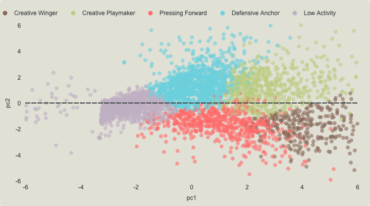
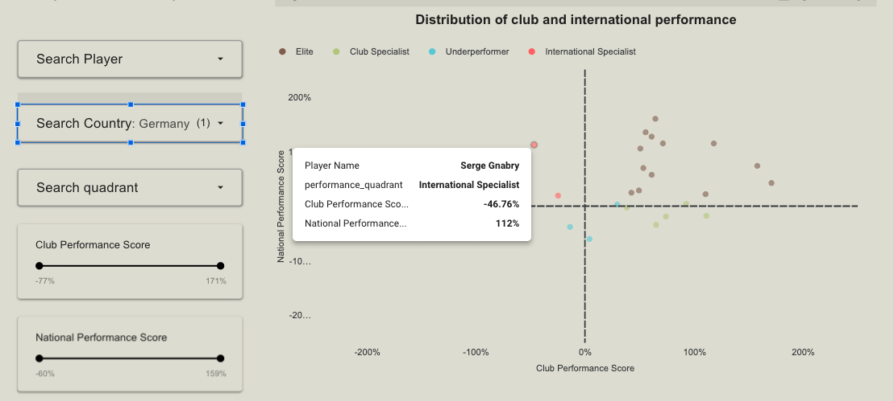
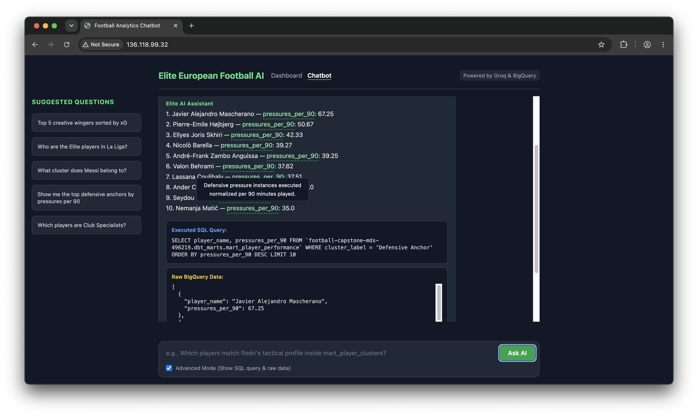
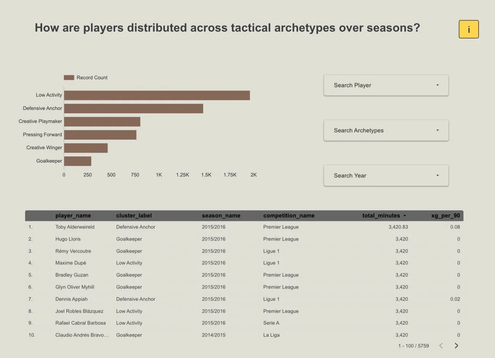
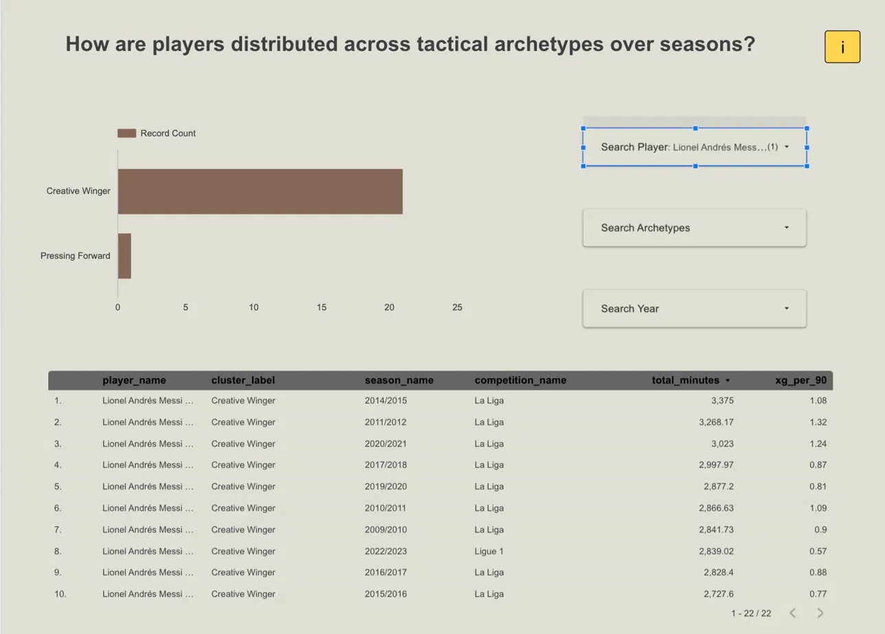
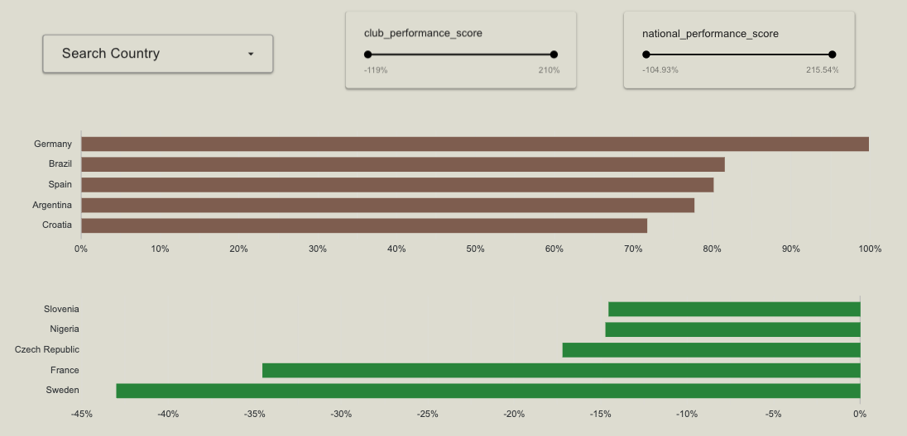
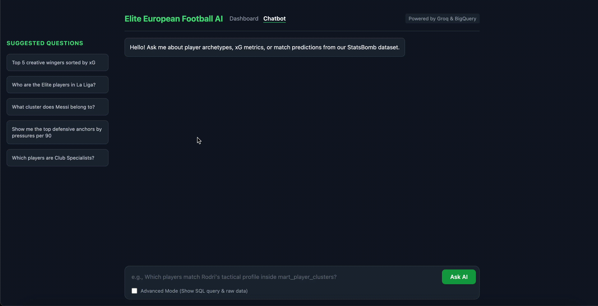
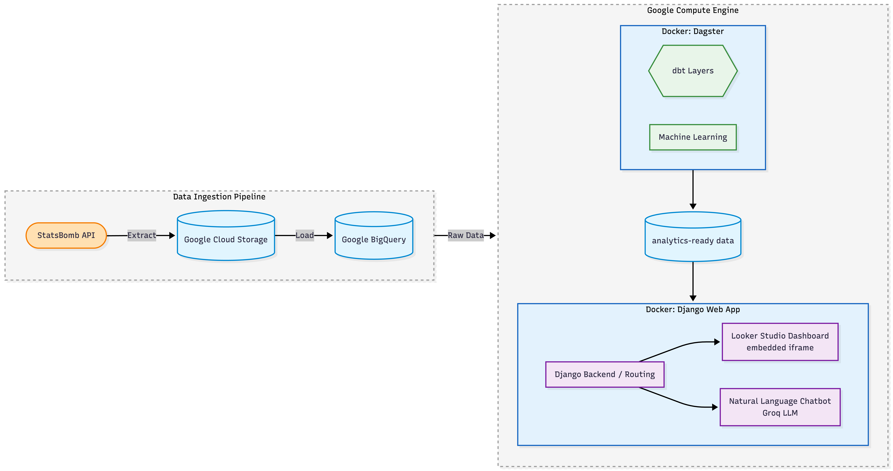
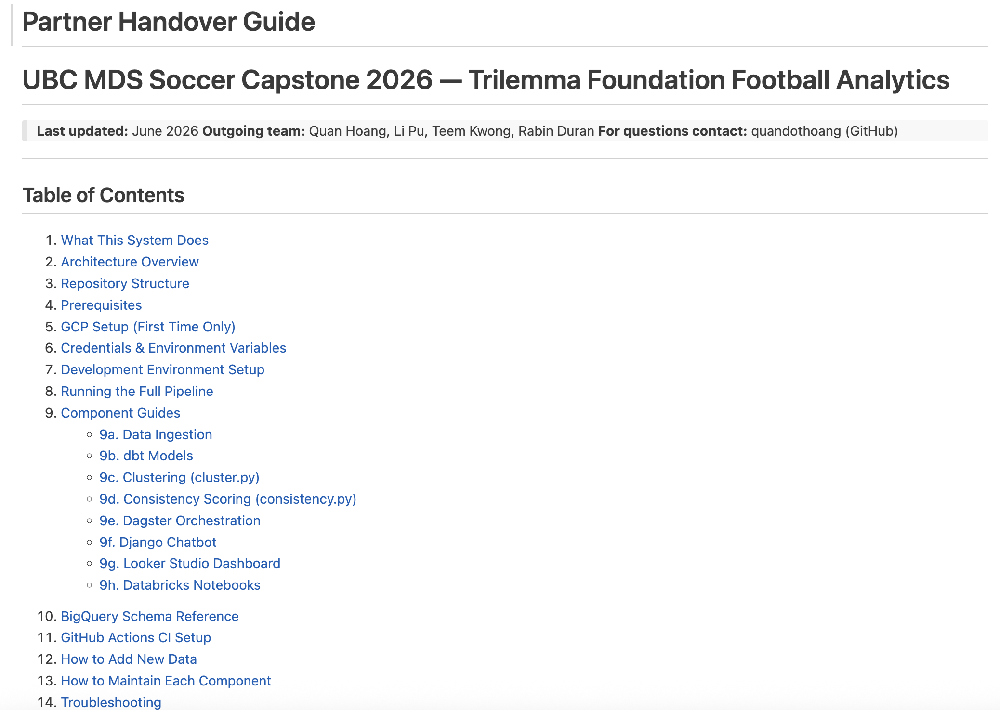

## Trilemma Foundation & Our Team

**Partner:** Trilemma Foundation — non-profit advancing **evidence-based football development** worldwide, partnering with clubs, federations, and analysts using StatsBomb event data.

| Name | Role |
|------|------|
| **Quan Hoang** | Data pipeline · dbt + Dagster |
| **Li Pu** | RQ1 · Player archetypes · Clustering |
| **Rabin Duran** | RQ2 · Consistency scoring · Explorer |
| **Teem Kwong** | RQ3 · Natural language chatbot |

::: {.notes}
Our team of four, each owning one research question and one deliverable. Trilemma Foundation is our industry partner — they work in football analytics and came to us with a data access problem.
:::

## Our Dataset — StatsBomb Event Data

- **Source:** StatsBomb open event data — every on-ball action (pass, shot, pressure, dribble, tackle) tracked per match
- **Scale:** 15 competitions · ~3.5 M events · 5,800+ player-seasons across multiple seasons of La Liga, Premier League, Champions League, Bundesliga, and more
- **Aggregation for ML:** player-season level · filtered to **≥ 270 minutes** (~3 full matches) to ensure statistically reliable samples
- **Scope:** men's competitions only · goalkeepers excluded from archetype clustering

::: {.notes}
StatsBomb is the gold standard for granular football event data. We aggregate to player-season level for ML — the 270-minute threshold ensures we're not clustering players on a handful of matches. Men's competitions only for consistency; extending to women's football is a noted future step.
:::

## Problem & Research Questions

**The gap:** StatsBomb event data exists, but analysts need complex SQL to extract meaning.

| RQ | Question | Who | Product |
|----|----------|-----|---------|
| **RQ1** | What tactical archetypes exist across competitions? | **Li** | Clustering + Looker dashboard |
| **RQ2** | Do players perform consistently club vs nationally? | **Rabin** | Consistency Explorer |
| **RQ3** | Can analysts query football data in plain English? | **Teem** | LLM chatbot |
| — | How does data get there automatically? | **Quan** | dbt + Dagster pipeline |

::: {.notes}
Three research questions, one shared automated pipeline. I'll preview the headline result from each, then hand off to each person for the methodology deep-dive. I'll cover the pipeline at the end.
:::

## RQ1: 5 Tactical Archetypes Found Across 15 Competitions

::: {.slide-image}

:::

::: {.slide-caption}
PCA scatter — 5 archetypes · 5,800+ player-seasons · 15 competitions · Li walks through the methodology
:::

::: {.notes}
Five distinct playing styles emerge from the data — data-driven labels, not hand-crafted categories. Li will cover the methodology and dashboard.
:::

## RQ2: Most Players Perform Differently Club vs Nationally

::: {.slide-image}

:::

::: {.slide-caption}
Performance score = weighted sum of Z-scores across 13 per-90 metrics · 493 players · 4 quadrants · Rabin covers the method
:::

::: {.notes}
493 players had enough minutes in both contexts. The axes are performance scores — how a player compares to peers within that specific context, not raw stats. Rabin explains the scoring model.
:::

## RQ3: Any Football Question, Answered in Plain English

::: {.slide-image}

:::

::: {.slide-caption}
Plain English → BigQuery SQL → formatted answer · under 10 sec · no SQL required · Teem demos live
:::

::: {.notes}
Type any football question in plain English, get an answer in under 10 seconds. No SQL knowledge needed. Teem demos this live shortly.
:::

## Clustering Pipeline {.compact}

**RQ1:** What player archetypes exist across European football?

| Step | Detail |
|------|--------|
| Input | `int_player_season_stats` from dbt |
| Filter | ≥ 270 min · goalkeepers excluded |
| Features | 13 per-90 metrics — see below |
| Model | Median impute · clip outliers · Scaler → PCA → KMeans k=5 |
| Output | 5 archetypes → `cluster_assignments` → Looker + chatbot |

::: {style="font-size:0.62em; color:#5E7A8A; margin-top:0.5em; line-height:1.5;"}
**13 per-90 features:** goals · xG · shots · passes · key passes · dribbles completed · pressures · tackles · interceptions · clearances · blocks · carries · aerial duels won
:::

::: {.notes}
Our first question: what tactical archetypes exist across European football? We take player-season stats from dbt's intermediate layer — only outfield players with at least 270 minutes played, which filters out players with too few appearances to be statistically meaningful. We run 13 per-90 metrics through a standard ML pipeline: median imputation, outlier clipping, scaling, then PCA to reduce dimensions, and finally KMeans with k=5. The output — cluster assignments for every player-season — lands in BigQuery and feeds both the dashboard and the chatbot.
:::

## Cluster Results: 5 Archetypes {.compact}

Per-90 metrics are prefixed `x_` in the dbt model (e.g. `x_goals`, `x_passes`, `x_pressures`).

| Archetype | Defining `x_` features |
|-----------|------------------------|
| **Creative Winger** | `x_xg`, `x_dribbles`, `x_passes` (att. third) |
| **Creative Playmaker** | `x_passes`, `x_carries`, `x_key_passes` |
| **Pressing Forward** | `x_pressures`, `x_shots`, `x_tackles` |
| **Defensive Anchor** | `x_interceptions`, `x_clearances`, `x_blocks` |
| **Low Activity** | Below-cohort average across most features |

::: {.notes}
KMeans produces 5 interpretable archetypes. Creative Wingers are defined by high xG and dribbling. Creative Playmakers by passing volume and chance creation. Pressing Forwards by high pressure counts and shots. Defensive Anchors by interceptions and clearances. And Low Activity players fall below the cohort average across most metrics. Goalkeepers are excluded from clustering entirely and assigned a separate label directly from their position — their statistical profile is fundamentally different from outfield players.
:::

## Cluster Scatter — What the Plot Shows

::: {.slide-image}

:::

::: {.slide-caption}
PC1 = overall activity level (left = low, right = high) · PC2 = defensive vs attacking profile (top = defensive) · colour = archetype
:::

::: {.notes}
This is the PCA scatter from Looker Studio. Each dot is one player-season. PC1 on the horizontal axis captures overall activity level — players on the right are more active. PC2 on the vertical axis separates attacking from defensive profiles. The 5 colour-coded clusters are clearly separated in PCA space, which validates that our features and k=5 choice are capturing real tactical differences.
:::

## Player Archetypes Dashboard — Overview

::: {.slide-image}

:::

::: {.slide-caption}
5,759 player-seasons · 15 competitions · Low Activity and Defensive Anchor are the largest groups · filter by archetype, year, or competition
:::

::: {.notes}
This is the Player Archetype Explorer in Looker Studio. Across 5,759 player-seasons from 15 competitions, Low Activity and Defensive Anchor are the two largest groups — consistent with football's positional mix. Analysts can filter by archetype, competition, or year to explore how the distribution shifts across different leagues and seasons.
:::

## Player Archetypes Dashboard — Explorer {.compact}

:::: {.columns}

::: {.column width="62%"}
{style="max-height: 54vh; width: auto; display: block; margin: 0 auto; border-radius: 4px; box-shadow: 0 2px 12px rgba(0,0,0,0.10);"}
:::

::: {.column width="38%"}
*Messi: Creative Winger across 22 La Liga seasons*

**What Trilemma can do with this:**

- **Scouting** — filter by archetype to find undervalued players in lower-budget leagues
- **Squad balance** — check archetype mix before a transfer window
- **Player tracking** — monitor how a player's style evolves across seasons
:::

::::

::: {.notes}
The explorer also supports player-level search. Here we've filtered to Messi — across 21 seasons he is consistently classified as Creative Winger, which aligns with his dribbling and xG profile. But there's one outlier season where he's classified as Pressing Forward — showing that even the same player can shift archetypes depending on how their role evolves. Any analyst can search any player to see their full archetype history. That wraps up RQ1 — Rabin will now cover RQ2, club vs national consistency.

:::

## Consistency: The Question & Pipeline

**RQ2:** Do players perform differently for club vs national team?

```{=html}
<div class="pipeline-box">
  int_player_club_vs_national &rarr; consistency.py &rarr; consistency_scores &rarr; Looker Explorer
</div>
```

- **Eligibility:** ≥ 270 minutes in **both** contexts (~3 full matches each)
- **Cohort:** 493 dual-context players across **58 countries**
- **Method:** Z-scores computed **within each context** separately — club peers vs club, national vs national

::: {.notes}
dbt builds int_player_club_vs_national, splitting statistics by context. 270+ minutes in both contexts gives us 493 players across 58 countries. Z-scores are calculated within each context so we compare apples to apples.
:::

## Consistency Formulas & Results {.compact}

**Z-score standardisation (within each context):**

$$Z\text{-score} = \frac{x - \mu_{\text{context}}}{\sigma_{\text{context}}}$$

**Performance score** = Σ (Z-score × PCA weight) — club & national axes on the scatter

**Consistency score** = $1 - \text{mean}(|Z_{\text{club}} - Z_{\text{national}}|)$ — profile similarity, not quality level

**Results:** 493 players · 58 countries · ~25% per quadrant · **Germany** leads national score · **Sweden** lowest in cohort

::: {.notes}
Three metrics. Performance scores give the X and Y axes. Consistency score measures how similar a player's profile is across the two contexts — a player can be consistently mediocre or consistently elite.
:::

## Quadrant Definitions

Split cohort at **medians** of club and national performance score (~25% each)

| Quadrant | Definition |
|----------|------------|
| **Elite** | ≥ median performance in **both** contexts |
| **Club Specialist** | Club ≥ median · national < median |
| **International Specialist** | Club < median · national ≥ median |
| **Underperformer** | Below median in both contexts |

::: {.notes}
Quadrants are defined at the medians of club and national performance scores so each group has roughly equal size. The key insight is which quadrant a specific player or national squad falls into.
:::

## Consistency Explorer — Quadrant View

**RQ2:** Club score (x) vs national score (y) — each point = one player

::: {.slide-image}

:::

::: {.slide-caption}
X-axis = club performance score · Y-axis = national performance score · quadrants split at medians · 493 players
:::

::: {.notes}
The core scatter. Call out specific players in each quadrant during the demo if possible — it makes the quadrant system concrete for the audience.
:::

## Consistency Explorer — Country Rankings {.compact}

**RQ2:** National performance score by country

:::: {.columns}

::: {.column width="60%"}
{style="max-height: 54vh; width: auto; display: block; margin: 0 auto; border-radius: 4px; box-shadow: 0 2px 12px rgba(0,0,0,0.10);"}
:::

::: {.column width="40%"}
*Germany leads · Sweden lowest · bar chart scaled to full range*

**What Trilemma can do with this:**

- **National selectors** — target International Specialists who outperform for country
- **Club recruitment** — Club Specialists may be undervalued on the transfer market
- **Next step** — extend to women's football; broaden international competition coverage
:::

::::

::: {.notes}
Country-level aggregation. Germany leads in our cohort. Note: make sure the bottom chart is scaled to the full data range before presenting. Teem now covers RQ3.
:::

## LLM chatbot

**RQ3:** Can analysts query football data in plain English?

::: {.slide-image}
[](http://34.11.235.252/)
:::

::: {.slide-caption}
Plain-English question → BigQuery SQL → formatted answer
:::

::: {.notes}
Chatbot in action. Show a real tactical question and the formatted response. Advanced mode shows the generated SQL for analysts who want to verify.
:::

## LLM chatbot — How It Works

- **Engine:** Groq `llama-3.3-70b-versatile`
- **Tool-calling:** English → BigQuery SQL → formatted answer
- **Advanced mode:** shows generated SQL for debugging

**What Trilemma can do with this:**

- **Self-serve analytics** — any analyst can get data-driven answers without writing SQL
- **Reduces bottleneck** — no need to queue a request to a data engineer for a simple question
- **Next step** — multi-step reasoning for complex queries; integrate with Looker for natural-language drill-downs

::: {.notes}
Django + Groq tool-calling loop. The chatbot democratises data access — right now single-step queries, next iteration could chain multiple reasoning steps.
:::

## System Architecture — End to End

::: {.slide-image}

:::

::: {.slide-caption}
StatsBomb API → GCS → BigQuery → Dagster (dbt + ML) → Django (GCE) → Looker Studio · Chatbot
:::

::: {.notes}
End-to-end architecture. StatsBomb data lands in Google Cloud Storage, then BigQuery. Dagster orchestrates dbt and ML scripts. Django on Google Compute Engine serves both the Looker embedded dashboard and the chatbot.
:::

## Architecture — Components

- **Ingestion:** StatsBomb API → Google Cloud Storage (GCS)
- **Warehouse:** Centralized in Google BigQuery
- **Transformation:** 3-layer dbt architecture
- **Machine Learning:** Python scripts for PCA/KMeans and Consistency Scoring
- **Serving:** Django web app · Looker Studio dashboard · LLM chatbot

::: {.notes}
5 layers. Quan covered dbt and Dagster earlier — here is how it connects to the products.
:::

## Data Transformation — dbt

**dbt** (data build tool) = **version-controlled SQL with automated testing** — like GitHub Actions for your data warehouse: define each transform as a SQL SELECT, declare dependencies, dbt runs them in order and tests each output.

- **Staging** — 3 models · type casts only · 1:1 mirror of raw StatsBomb tables
- **Intermediate** — 7 models · 270-min filter · compute `x_*` per-90 metrics · men's competitions only
- **Marts** — 5 models · join ML outputs (cluster assignments + consistency scores) · final tables for Looker + chatbot

```{=html}
<div style="display:flex; align-items:center; justify-content:center; margin-top:0.8em; gap:0.5em; font-size:0.88em; font-family:'Calibri','Segoe UI',Arial,sans-serif;">
  <span class="arch-node orange">raw_statsbomb</span>
  <span class="arch-arrow">→</span>
  <span class="arch-node blue">staging</span>
  <span class="arch-arrow">→</span>
  <span class="arch-node blue">intermediate</span>
  <svg width="52" height="90" viewBox="0 0 52 90" style="flex-shrink:0; overflow:visible;">
    <line x1="0"  y1="45" x2="22" y2="45" stroke="#90A4AE" stroke-width="1.5"/>
    <line x1="22" y1="18" x2="22" y2="72" stroke="#90A4AE" stroke-width="1.5"/>
    <line x1="22" y1="18" x2="52" y2="18" stroke="#90A4AE" stroke-width="1.5"/>
    <line x1="22" y1="72" x2="52" y2="72" stroke="#90A4AE" stroke-width="1.5"/>
  </svg>
  <div style="display:flex; flex-direction:column; gap:0.7em; align-items:flex-start;">
    <span class="arch-node green"><b>marts</b></span>
    <span class="arch-node green"><b><i>ML models</i></b></span>
  </div>
</div>
```

::: {.notes}
dbt lets us write modular, testable SQL. Every model has automated schema tests. The x_ prefix in intermediate marks per-90 computed columns. If a test fails, Dagster catches it before bad data reaches the dashboard.
:::

## Pipeline Orchestration — Dagster

**Dagster** = **automated scheduler + dependency graph** — like GitHub Actions job order for data: knows what must run before what, and surfaces failures visually.

:::: {.columns}

::: {.column width="38%"}
- **Weekly schedule** — full pipeline every Monday 6:00 AM UTC
- **Hourly sensor** — new GCS file → dbt + ML only (skips re-ingestion)
- **Zero manual runs** — fully hands-off for Trilemma after handover
- **Asset graph** — every step tracked; failures surface immediately with clear error messages
:::

::: {.column width="62%"}
{width="100%"}

::: {.slide-caption}
Asset graph · ingestion → dbt → ML → marts
:::
:::

::::

::: {.notes}
Dagster is what makes the pipeline production-grade. Without it, someone would need to manually trigger each step in the right order. Each node in the asset graph is a dbt model or ML script. If ingestion fails, everything downstream is automatically skipped with a clear error.
:::

## Limitations & Future Scope

- **Goalkeeper Filter** — excluded from PCA clustering (`cluster = -1`, archetype = "Goalkeeper")
- **Data Asymmetry** — open-source StatsBomb data is inherently unbalanced; match volume varies by competition and season
- **Women's football** — intermediate layer filters to men's competitions; extending requires parallel dbt models
- **Chatbot scope** — single-step queries only; complex multi-step reasoning not yet supported

::: {.notes}
Four honest limitations. Goalkeepers are methodologically excluded. Data coverage isn't uniform. Women's football needs a separate dbt branch. The chatbot handles well-formed single questions but can't yet chain reasoning steps.
:::

## Partner Handover — What Trilemma Gets

- Fully documented **GitHub repository**
- **CI/CD Pipeline** → automated tests + automated deployment
- **Quarto** final report with methodology documentation
- **`HANDOVER.md`** — component-level runbooks for each service
- **`docker compose up`** → spins up Django app + Dagster UI locally

::: {.notes}
What the partner receives. The goal is that any new developer at Trilemma can pick up any component independently without reading the whole codebase.
:::

## Partner Handover

::: {.slide-image}

:::

::: {.notes}
The HANDOVER.md structure — one section per component. That concludes our presentation — we'll open the floor to questions.
:::

## Thank You {.title-slide}

### Questions?

**Team:** Quan Hoang · Li Pu · Teem Kwong · Rabin Duran

**Repo:** [UBC-MDS-Soccer-Capstone-2026](https://github.com/TrilemmaFoundation/UBC-MDS-Soccer-Capstone-2026)

::: {.notes}
Thank you — we'll now open the floor to any questions.
:::
