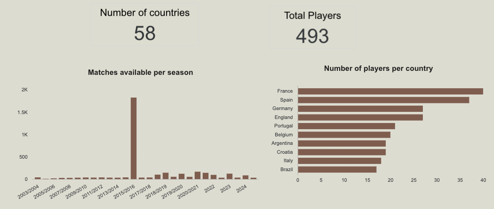

## Problem & Roadmap

**The gap:** StatsBomb event data exists, but analysts need complex SQL to use it.

| RQ | Question | Who |
|----|----------|-----|
| **RQ1** | What tactical archetypes exist across competitions? | **Li** · clustering + dashboard |
| **RQ2** | Do players perform consistently club vs nationally? | **Rabin** · Consistency Explorer |
| **RQ3** | Can analysts query football data in plain English? | **Teem** · chatbot |
| — | How does data get there? | **Quan** · dbt + Dagster |

::: {.notes}
Trilemma had rich StatsBomb data but no scalable way to answer these questions without writing complex SQL. This table is our map for the talk — three research questions, each answered by a different part of the product. I'll walk you through how the data gets there first, then hand off to the rest of the team.
:::

## Data Pipeline — dbt {.compact}

StatsBomb API → GCS → BigQuery → **dbt** (3 layers) → chatbot + dashboard

- **Staging** — type casts only, 1:1 mirror
- **Intermediate** — 270-min filter, per-90 metrics, men's only
- **Marts** — ML outputs joined in

**dbt** = **Makefile + git for SQL** — version-controlled `SELECT`s with tests.

*Orchestrated by **Dagster** — next slide.*

::: {.notes}
Before the results: three ingestion scripts land StatsBomb data in BigQuery. dbt transforms it in three layers. If you've used Make or GitHub Actions, dbt is the same idea — define steps, declare dependencies, run tests. Dagster runs the whole thing automatically.
:::

## Pipeline Orchestration — Dagster {.compact}

**Dagster** = **cron + Makefile dependency graph** (like GitHub Actions job order)

- **Weekly** — full pipeline, Monday 6:00 AM UTC
- **Hourly sensor** — new GCS file → dbt + ML + marts only
- Hands-off for Trilemma — no manual runs

::: {.notes}
Dagster is the scheduler and dependency manager on top of dbt. Think cron, but smarter: it knows ingestion must finish before dbt, clustering before consistency, and shows you a visual graph when something breaks.
:::

## RQ1: 5 Tactical Archetypes Found Across 15 Competitions

::: {.slide-image}

:::

::: {.slide-caption}
5 archetypes · 5,800+ player-seasons · 15 competitions
:::

::: {.notes}
Before the deep dives — here's what we found. This scatter is every outfield player-season in our dataset, coloured by archetype. Five distinct playing styles emerge from the data: Creative Wingers on the right, Defensive Anchors at the top, Pressing Forwards in the bottom middle, and Low Activity players on the far left. Li will walk through the methodology and dashboard in detail.
:::

## RQ2: Most Players Perform Differently Club vs Nationally

::: {.slide-image}

:::

::: {.slide-caption}
493 players · Elite · Club Specialist · International Specialist · Underperformer
:::

::: {.notes}
Second result — consistency scoring. 493 players had enough minutes in both club and international football to compare. We put each player in one of four quadrants based on their performance in each context. Rabin will go deep on the methodology and findings.
:::

## RQ3: Any Football Question, Answered in Plain English

::: {.slide-image}

:::

::: {.slide-caption}
Plain English in · answers in \< 10 sec · no SQL
:::

::: {.notes}
Third result — the chatbot. Analysts type a question in plain English, and the system writes the BigQuery SQL, runs it, and returns a formatted answer in under 10 seconds. No SQL knowledge required. Li will now walk through RQ1 — the clustering methodology and player archetypes dashboard.
:::

## Clustering Pipeline {.table-md}

**RQ1:** What player archetypes exist across European football?

| Step | Detail |
|------|--------|
| Input | `int_player_season_stats` from dbt |
| Filter | ≥ 270 min · goalkeepers excluded |
| Features | 13 per-90 metrics (xG, passes, pressures, …) |
| Model | Median impute · clip outliers · Scaler → PCA → KMeans k=5 |
| Output | 5 archetypes → `cluster_assignments` → Looker + chatbot |

::: {.notes}
For RQ1, we cluster outfield players by playing style. Per-season stats from dbt, 270-minute minimum, goalkeepers excluded, 13 features through PCA and KMeans. Output lands in BigQuery and feeds the dashboard and chatbot.
:::

## Cluster Results: 5 Archetypes {.table-lg}

| Archetype | Style |
|-----------|-------|
| **Creative Winger** | xG, dribbles, att. third passes |
| **Creative Playmaker** | Passes, carries, chance creation |
| **Pressing Forward** | Pressures, shots, defensive actions |
| **Defensive Anchor** | Interceptions, clearances, blocks |
| **Low Activity** | Below-cohort activity |

::: {.notes}
KMeans produces five interpretable archetypes plus a separate goalkeeper label. Next slide: the Looker scatter — crop it so labels are readable.
:::

## Cluster Scatter — Looker Studio

::: {.slide-image}

:::

::: {.slide-caption}
PCA scatter · colour-coded archetypes
:::

::: {.notes}
The scatter plot shows PCA space with 5 colour-coded archetypes. PC1 captures overall activity level — players on the right are more active. PC2 separates attacking from defensive profiles. Each dot is one player-season.
:::

## Player Archetypes Dashboard — Overview

::: {.slide-image}

:::

::: {.slide-caption}
Cohort overview · archetype distribution
:::

::: {.notes}
The Player Archetype Explorer shows the full distribution across 5,759 player-seasons. Low Activity and Defensive Anchor are the largest groups. Analysts can filter by year, competition, or archetype to drill down.
:::

## Player Archetypes Dashboard — Explorer

::: {.slide-image}

:::

::: {.slide-caption}
Top players by archetype · filter by player
:::

::: {.notes}
Searching by player shows all seasons for that player. Messi is classified as Creative Winger across most La Liga seasons — consistent with his dribbling and xG profile. This wraps up RQ1 and RQ2 — Rabin covers RQ3 next.
:::

## Consistency: The Question & Pipeline {.mermaid-md}

**RQ2:** Do players perform differently for club vs national team?

```{mermaid}
%%| fig-width: 10
%%{init: {'themeVariables': {'fontSize': '18px'}, 'flowchart': {'nodeSpacing': 38, 'rankSpacing': 34, 'padding': 12}}}%%
flowchart LR
    A[dbt: int_player_club_vs_national] --> B[consistency.py]
    B --> C[analytics.consistency_scores]
    C --> D[Looker Consistency Explorer]
```

- **Eligibility:** ≥ 270 minutes in **both** contexts (~3 full matches)
- **Cohort:** 493 dual-context players across **58 countries**
- Z-scores computed **within each context** (club peers vs club, national vs national)

::: {.notes}
We built club-vs-national consistency scoring for RQ2. Trilemma wanted to know whether strong club players show up the same way for their country. dbt builds int_player_club_vs_national, splitting stats by context and z-scoring 13 metrics within each. consistency.py weights z-scores with PCA loadings, computes scores and quadrants, and writes to BigQuery. Only players with 270+ minutes in both contexts qualify — 493 players across 58 countries.
:::

## Consistency Formulas & Results {.compact}

**Formulas**

1. $z = (x - \mu_{\text{context}}) / \sigma_{\text{context}}$ within each context
2. **Performance score** = Σ (z × PCA weight) — club & national axes on scatter plot
3. **Consistency score** = $1 - \text{mean}(|z_{\text{club}} - z_{\text{nat}}|)$ — profile similarity, not quality

**Results**

- **493 players** · **58 countries** · ~25% per quadrant
- **Most consistent** → profile barely changes between contexts
- **Germany** leads national score · **Sweden** lowest in cohort

::: {.notes}
Three metrics: performance scores are the scatter axes; consistency measures profile similarity across contexts, not quality. Headline results before the dashboard walkthrough — 493 dual-context players, roughly even quadrant split, Germany leads on national performance.
:::

## Quadrant Definitions {.table-lg}

Split cohort at **medians** of club & national performance (~25% each)

| Quadrant | Rule |
|----------|------|
| **Elite** | ≥ median in **both** contexts |
| **Club Specialist** | Club ≥ median, national \< median |
| **International Specialist** | Club \< median, national ≥ median |
| **Underperformer** | Below median in both |

::: {.notes}
Quadrants split at medians. Next slides show this in Looker — one cropped screenshot per page.
:::

## Consistency Explorer — Overview {.slide-image-lg}

::: {.slide-image}

:::

::: {.notes}
Page 1 — coverage and cohort size. Crop so 493 players and 58 countries are the largest text on screen.
:::

## Consistency Explorer — Quadrant View {.slide-image-lg}

::: {.slide-image}

:::

::: {.notes}
Page 2 — the core scatter. Crop aggressively: quadrant labels, axis titles, and a few player names must be readable from the back.
:::

## Consistency Explorer — Country Rankings {.slide-image-lg}

::: {.slide-image}

:::

::: {.notes}
Page 3 — Germany leads in our cohort. Crop the ranking table or chart so country names and scores are legible. Everything in Looker is also queryable through our chatbot — Teem covers that next.
:::

## System Architecture

```{mermaid}
flowchart LR
    %% Node Definitions
    SB([StatsBomb API])
    GCS[(Google Cloud Storage)]
    BQ[(Google BigQuery)]
    ML[Machine Learning]
    
    %% Infrastructure: Google Compute Engine
    subgraph GCE [Google Compute Engine]
        direction TB
        
        %% Docker: Dagster
        subgraph DockerDagster [Docker: Dagster]
            DBT{{dbt Layers}}
        end
        
        %% Docker: Django
        subgraph DockerDjango [Docker: Django Web App]
            direction TB
            Core[Django Backend / Routing]
            Looker[Looker Studio Dashboard<br/>embedded iframe]
            Chatbot[Natural Language Chatbot<br/>Groq LLM]
            
            Core --> Looker
            Core --> Chatbot
        end
    end

    %% Pipeline Connections
    SB -- "Extract" --> GCS
    GCS -- "Load" --> BQ
    BQ -- "Raw Data" --> DBT
    DBT -- "Clean Data" --> ML
    
    %% Connection to Serving Layer
    ML -- "ML Outputs & Marts" --> Core

    %% Styling 
    classDef source fill:#ffe0b2,stroke:#f57c00,stroke-width:2px;
    classDef storage fill:#e1f5fe,stroke:#0288d1,stroke-width:2px;
    classDef compute fill:#e8f5e9,stroke:#388e3c,stroke-width:2px;
    classDef serve fill:#f3e5f5,stroke:#7b1fa2,stroke-width:2px;
    classDef docker fill:#e3f2fd,stroke:#1565c0,stroke-width:2px;
    classDef vm fill:#f5f5f5,stroke:#9e9e9e,stroke-width:2px,stroke-dasharray: 5 5;
    
    class SB source;
    class GCS,BQ storage;
    class ML compute;
    class Core,Looker,Chatbot serve;
    class DockerDagster,DockerDjango docker;
    class GCE vm;
```

::: {.slide-caption}
End-to-end pipeline: data → serving
:::

::: {.notes}
Thanks Rabin. End-to-end architecture: StatsBomb to GCS to BigQuery, dbt transforms, ML enriches, Django serves Looker and the chatbot. Replace this placeholder with a clean architecture diagram or screenshot.
:::

## Architecture — Components {.compact}

System Architecture: End-to-End

- Ingestion: StatsBomb API to Google Cloud Storage (GCS)
- Warehouse: Centralized in Google BigQuery
- Transformation: 3-layer dbt architecture
- Machine Learning: Python scripts for PCA/KMeans and Consistency Scoring
- Serving Layer: Django web application, Looker Studio dashboard, and LLM chatbot

::: {.notes}
Four layers. Quan covered dbt and Dagster earlier — here is how it connects to the products.
:::

## dbt Layers (Detail) {.mermaid-lg}

```{mermaid}
%%| fig-width: 14
%%{init: {'themeVariables': {'fontSize': '26px'}, 'flowchart': {'nodeSpacing': 70, 'rankSpacing': 55, 'padding': 24}}}%%
flowchart LR
    RAW[raw_statsbomb] --> STG[staging]
    STG --> INT[intermediate]
    INT --> MART[marts]
```

- **Staging** — 1:1 mirror, type casts only
- **Intermediate** — men's filter, 270-min threshold, per-90 metrics
- **Marts** — ML outputs joined in → chatbot + Looker read here

::: {.notes}
Looking closer at the transformation pipeline, we adopted a strict three-layer dbt architecture. Raw StatsBomb parquet files land in our GCS bucket and BigQuery. Staging acts purely as a 1:1 mirror to clean up data types. The heavy lifting happens in the intermediate layer, where we aggregate per-90 metrics, apply our 270-minute playing threshold to remove statistical noise, and scope the current data to men's competitions. Finally, our marts layer joins these transformations with the ML cluster assignments, producing the clean tables that Looker and our chatbot read from.
:::

## Dagster Asset Graph

::: {.slide-image}

:::

::: {.slide-caption}
Asset graph · ingestion → dbt → ML → marts
:::

::: {.notes}
Dagster asset graph screenshot. Crop so asset names and the schedule are readable. Quan already defined Dagster — here we show what it looks like in practice.
:::

## Dagster — How It Runs

- **Asset graph** — run in order: Ingestion → dbt → ML → mart refresh
- **`full_pipeline_job`** — every Monday 6:00 AM UTC
- **Hourly GCS sensor** — new match file → `post_ingestion_job` only (no re-ingestion loop)

::: {.notes}
Weekly full refresh plus hourly sensor for manual uploads. Same Dagster concept as Quan introduced — cron with a dependency graph.
:::

## Chatbot Demo

::: {.slide-image}

:::

::: {.slide-caption}
Plain-English question → BigQuery answer
:::

::: {.notes}
Chatbot in action. One screenshot, cropped large. Show a real tactical question and the formatted response.
:::

## Chatbot — How It Works

- **Engine:** Groq `llama-3.3-70b-versatile`
- **Tool-calling:** English → BigQuery SQL → formatted answer
- **Security:** `is_safe_sql` blocks non-SELECT statements
- **Advanced mode:** shows generated SQL for debugging

::: {.notes}
Django + Groq tool-calling loop. Security layer blocks anything that isn't a SELECT. Advanced mode lets analysts verify the SQL.
:::

## Limitations & Future Scope

- **Goalkeepers** — excluded from PCA clustering (`cluster = -1`, archetype Goalkeeper)
- **Polymarket odds** — manual GCS upload only; no automated ingestion yet
- **Women's football** — men's filter at intermediate layer; needs parallel dbt models

::: {.notes}
Three known limitations and future work items. Keep it brief before handover.
:::

## Partner Handover — What Trilemma Gets

- Fully documented **GitHub repository**
- **Quarto** final report
- **`HANDOVER.md`** — component runbooks
- **`docker compose up`** → Django app + Dagster UI

::: {.notes}
What the partner receives. Next slide: screenshot of the repo README or HANDOVER.md top section.
:::

## Partner Handover — Repository

::: {.slide-image}

:::

::: {.notes}
Screenshot of HANDOVER.md or README so the audience sees the partner can run this themselves. That concludes our presentation — we'll open the floor to questions.
:::

## Thank You {.title-slide}

### Questions?

**Team:** Quan Hoang · Li Pu · Teem Kwong · Rabin Duran

**Repo:** [UBC-MDS-Soccer-Capstone-2026](https://github.com/TrilemmaFoundation/UBC-MDS-Soccer-Capstone-2026)

::: {.notes}
That concludes our presentation. Thank you, and we'll now open the floor to any questions.
:::
