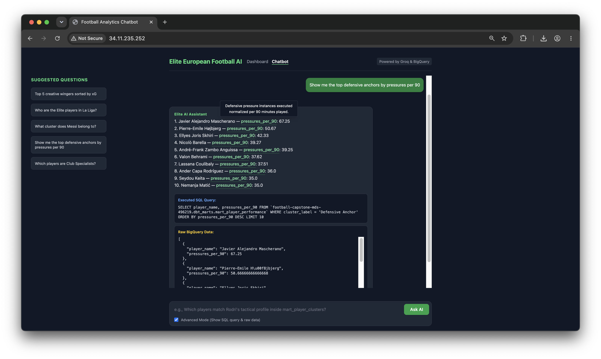
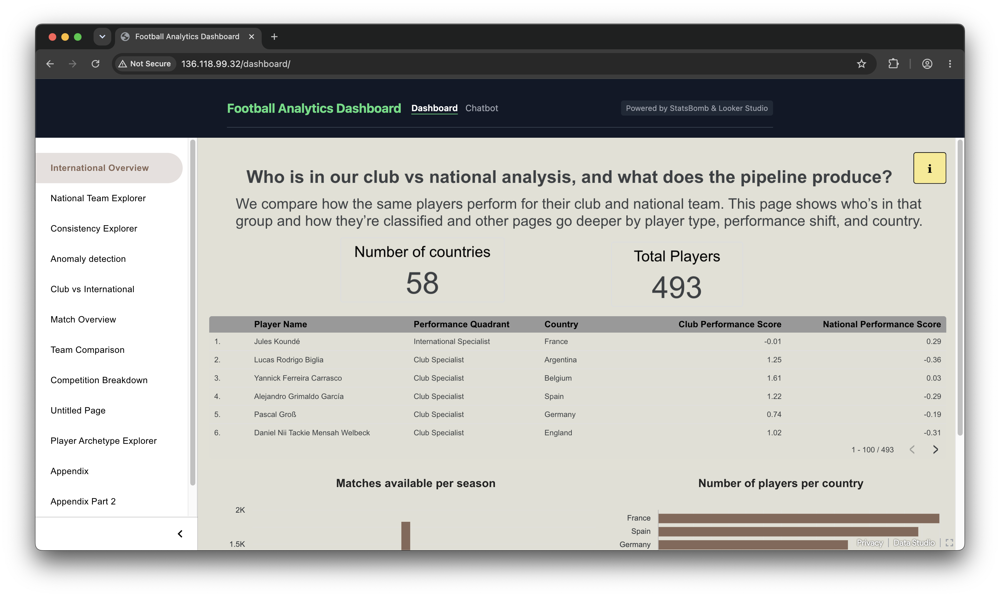

# Executive Summary



# Introduction



# Data



# Data Science Methods

## Player Archetype Clustering

### Motivation

A key analytical goal of this project is to characterise *how* players play, not just *how well*. Raw per-90 statistics are difficult for coaches and analysts to interpret at scale across thousands of player-seasons. We address this by clustering players into a small set of interpretable tactical archetypes that can be used to compare playing styles across competitions and seasons.

### Data and Scope

The clustering pipeline operates on `int_player_season_stats`, the dbt intermediate table containing aggregated per-90 statistics for each player-season combination. A minimum threshold of **270 minutes** of playing time per season was applied to exclude players with insufficient data for reliable per-90 rate estimation, yielding **5469 outfield player-season records** across all competitions in the dataset.

**Goalkeepers** were identified by `position_name = 'Goalkeeper'` and excluded from the clustering pipeline entirely. Their statistical profiles are structurally distinct from outfield players (no shots, xG, or dribbles in typical event data), and mixing them with outfield players would distort the feature space. Goalkeepers were subsequently assigned a fixed archetype label of `"Goalkeeper"` (cluster id = −1) without going through K-Means.


### Feature Selection

Thirteen per-90 features were selected to capture a broad range of tactical contributions spanning attacking output, ball progression, defensive work, and technical quality:

| Feature | Tactical dimension |
|---|---|
| `xg_per_90`, `shots_per_90` | Attacking threat |
| `passes_per_90`, `passes_att_third_per_90`, `pass_completion_pct` | Ball circulation and progression |
| `carries_per_90`, `dribbles_per_90` | Direct ball-carrying |
| `pressures_per_90` | Defensive pressure and pressing |
| `interceptions_per_90`, `blocks_per_90`, `clearances_per_90`, `duels_per_90` | Defensive actions |
| `xg_per_shot` | Shot quality / efficiency |

Features were chosen to align with the 13 dimensions used in the PCA loadings table (`analytics.pca_loadings`), ensuring consistency between the clustering pipeline and the dashboard visualisations.

### Preprocessing

Three preprocessing steps were applied in sequence before modelling:

1. **Median imputation.** Missing values (arising from players with zero events of a particular type in a season) were filled with the column median. This preserves the natural zero-skewed distribution of defensive metrics without introducing artificial mean values.

2. **99th percentile clipping.** Values above the 99th percentile were capped column-wise to limit the influence of statistical outliers on the scaling step. 

3. **StandardScaler.** All features were standardised to zero mean and unit variance. This ensures that features with naturally larger magnitudes (e.g., `passes_per_90` in the hundreds) do not dominate features with smaller magnitudes (e.g., `xg_per_shot` in the range 0–1).

### Dimensionality Reduction (PCA)

Principal Component Analysis was applied to the scaled feature matrix to reduce noise and multicollinearity among the 13 features. The number of components was selected automatically using an 80% cumulative explained variance threshold, which typically results in 6 principal components depending on the data.

The leading components capture interpretable structure in the data:

- **PC1** loads positively on overall activity metrics (pressures, carries, passes), representing a general *volume of involvement* dimension.
- **PC2** contrasts defensive actions (interceptions, clearances) against attacking output (xG, shots), separating defensive and attacking profiles.

A separate 2-component PCA projection (PC1 vs PC2) was computed for visualisation purposes, allowing cluster membership to be displayed as a 2D scatter plot in the Looker Studio dashboard.

### Clustering (K-Means)

K-Means clustering with **k = 5** was applied to the 6-component PCA-reduced feature space. The number of clusters was selected through a combination of the elbow method (inertia vs k) and interpretability: five outfield clusters produce tactically coherent archetypes that are meaningful to football analysts without over-segmenting the data. Model parameters: `random_state = 42`, `n_init = 10`.

### Archetypes

The six final archetypes (5 K-Means clusters + 1 rule-based goalkeeper label) and their distribution across the full dataset are shown in @tbl-cluster-dist.

| Archetype | Player-seasons | Tactical profile |
|---|---|---|
| Low Activity | 1,963 | Low volume across all metrics; squad players and limited roles |
| Defensive Anchor | 1,470 | High clearances, interceptions, duels; low attacking output |
| Creative Playmaker | 807 | High pass completion, progressive passes, carries; attacking midfielders |
| Pressing Forward | 766 | High pressures, shots, and xG; high-energy forwards and pressing wingers |
| Creative Winger | 463 | High dribbles, carries, shots; direct wide attackers |
| Goalkeeper | 290 | Assigned by position; excluded from K-Means |

: Player archetype distribution across all player-seasons. {#tbl-cluster-dist}

### Notable Findings

The archetype framework captures genuine tactical variation both within and across careers. A player's archetype can change between seasons, reflecting real shifts in their role. For example, Lionel Messi is classified as **Creative Winger** for the majority of his career but as **Pressing Forward** during Copa America 2024, consistent with the more compact, press-oriented system deployed by the Argentina national team in that tournament. This highlights that archetypes describe *how a player is used* in a given season rather than a fixed career identity.

At the competition level, archetype distributions differ across leagues. The Bundesliga shows a higher share of Pressing Forwards relative to Serie A, where Low Activity is the largest single bucket among the top-five European leagues. These differences are secondary to position effects (see RQ1 analysis), but confirm that league context influences tactical role assignment at the margins.

## Data Pipeline

### Overview

The data product is underpinned by a fully automated ELT pipeline that moves raw StatsBomb event data from a public API through cloud storage, transformation, machine learning, and into end-user analytics interfaces. The pipeline has five layers: ingestion, cloud storage, transformation (dbt), machine learning (Python scripts), and orchestration (Dagster). @fig-architecture illustrates the full architecture.

::: {#fig-architecture fig-pos="H"}

```{mermaid}
flowchart LR
    SB([StatsBomb API]) -- Extract --> GCS[(GCS)]
    GCS -- Load --> BQ[(BigQuery\nraw_statsbomb)]
    BQ -- dbt --> MART[(BigQuery\ndbt marts)]
    MART -- cluster.py\nconsistency.py --> ML[(BigQuery\nanalytics)]
    ML --> APP[Django App]
    APP --> LOOKER[Looker Studio\nDashboard]
    APP --> CHAT[LLM Chatbot\nGroq]
```

Pipeline architecture: StatsBomb open data flows through GCS and BigQuery, is transformed by dbt into analytics-ready marts, enriched by ML scripts, and served to end-users via Looker Studio and the Django chatbot.
:::

### Ingestion Layer

The ingestion script (`src/ingestion/statsbomb.py`) reads `matches`, `events`, and `lineups` from the StatsBomb open API via `statsbombpy`, serializes them as Parquet, and loads them into the `raw_statsbomb` BigQuery dataset via GCS (`raw/statsbomb/{table}/`). Each load uses `WRITE_TRUNCATE` to keep runs idempotent; deduplication is handled downstream in dbt staging.

### Transformation Layer (dbt)

All transformation logic lives in a dbt project targeting BigQuery, organized into three layers.

**Staging** models (`models/staging/`) perform a one-to-one mapping from raw tables to typed, renamed columns: explicit BigQuery type casts, derivation of the `is_international` boolean flag, and parsing of substitution timestamps into float minutes.

**Intermediate** models (`models/intermediate/`) join, aggregate, and apply business logic. `int_player_match_stats` aggregates on-ball events to one row per player per match, computing 22 metrics and deriving minutes played from lineup data. `int_player_season_stats` rolls these up to player-competition-season level, applies the 270-minute minimum filter, and computes all 13 per-90 features used in the clustering pipeline. `int_player_club_vs_national` aggregates by player and context (`is_international`), retains only players with ≥270 minutes in both club and national football, and computes within-context z-scores for all 13 features — the direct inputs to the consistency pipeline.

**Mart** models (`models/marts/`) are the final analytics-ready tables consumed by Looker Studio and the chatbot. `mart_player_clusters` joins player-season stats with K-Means outputs and derives PCA coordinates in-database. `mart_player_performance` enriches the same base with consistency scores from `analytics.consistency_scores`. All mart models are materialized as BigQuery tables with schema tests run in CI on every pull request.

### Machine Learning Layer

Two Python scripts bridge the dbt intermediate layer and the mart layer: `src/ml/cluster.py` for archetype clustering and `src/ml/consistency.py` for club-vs-national scoring. Both read from `dbt_intermediate` and write outputs to the `analytics` BigQuery dataset. Methodology for each is described in the Player Archetype Clustering subsection and the RQ3 analysis.

### Orchestration (Dagster)

All assets are wired in a Dagster OSS instance (`src/dagster/`) with four asset layers: ingestion (`raw_statsbomb`), dbt transformation (`football_analytics_dbt_assets`), clustering (`cluster_assignments`), and consistency scoring (`consistency_score`). A weekly `ScheduleDefinition` (Mondays at 06:00 UTC) runs the full pipeline; an hourly `SensorDefinition` triggers a targeted dbt + ML refresh when new files land in GCS, without re-running ingestion.

### Pipeline Validation

End-to-end validation confirmed consistent row counts across layers (@tbl-rowcounts).

| Layer | Table | Rows |
|-------|-------|------|
| Intermediate | `int_player_season_stats` | 5,759 |
| Intermediate | `int_player_club_vs_national` | 979 |
| ML output | `analytics.cluster_assignments` | 5,759 |
| ML output | `analytics.pca_loadings` | 52 (13 features × 4 PCs) |
| ML output | `analytics.consistency_scores` | 489 |
| Mart | `mart_player_clusters` | 5,759 |
| Mart | `mart_player_performance` | 5,759 |

: End-to-end pipeline row counts verified in BigQuery (`football-capstone-mds-496219`). {#tbl-rowcounts}

Player-season counts align at 5,759 across all intermediate, ML, and mart layers. The dual-context cohort yields 979 context rows (club + national) for 489 players, each assigned a performance quadrant in `analytics.consistency_scores`.

# Analysis

This section answers the core research questions using pipeline outputs (`mart_player_clusters`, `analytics.consistency_scores`) and exploratory notebooks `07_rq1_role_distribution.py` and `08_rq3_four_quadrant_consistency.py`. All player-level analyses apply the project-wide **270-minute minimum** per context or player-season unless noted otherwise.

## RQ1: Player Role Distribution Across Competitions

**Question:** How does player role distribution differ across competitions and positions?

We assign each player-season in the top-five European leagues (La Liga, Premier League, Bundesliga, Serie A, Ligue 1) to one of five outfield **tactical archetypes** from PCA + K-Means on 13 per-90 features, plus a separate **Goalkeeper** label (`cluster_id = -1`). Archetypes are defined in @tbl-archetypes.

| Cluster ID | Archetype | Tactical profile |
|------------|-----------|------------------|
| 0 | Low Activity | Low volume across attacking and defensive per-90 metrics |
| 1 | Creative Playmaker | High passes, carries, and progressive play |
| 2 | Creative Winger | High dribbles, carries, and attacking xG |
| 3 | Pressing Forward | High shots, xG, and pressing activity |
| 4 | Defensive Anchor | High clearances, interceptions, and duels |
| −1 | Goalkeeper | Assigned from position, excluded from K-Means |

: Outfield archetype labels from `src/ml/cluster.py` and `seeds/cluster_labels.csv`. {#tbl-archetypes}

### Position drives role assignment

Chi-square tests on **position group × cluster** (groups: GK, CB, FB, CM, AM, FW) show that **tactical role is strongly associated with position** (Notebook 07). Cramér's V for this association is materially larger than for competition-level effects. In row-normalized heatmaps:

- **Center backs** concentrate in **Defensive Anchor** and **Low Activity** clusters. Attacking clusters are rare.
- **Forwards and attacking mids** skew toward **Pressing Forward** and **Creative Winger**, reflecting shot volume, xG, and dribble-heavy profiles.
- **Central mids** spread across **Creative Playmaker**, **Pressing Forward**, and **Low Activity**. That pattern fits box-to-box and pivot roles with overlapping event mixes.
- **Full backs** often land in **Creative Winger** or **Creative Playmaker** when their per-90 profiles emphasize carries and passes into the final third.

Position is therefore the primary lens for interpreting cluster membership: archetypes describe *how* a player plays within a position's event mix, not a replacement for position labels.

### Competition effects are secondary but visible

When cluster mix is compared **across leagues** (competition × cluster), the overall association is **weaker than position × cluster** (Notebook 07, KQ2a). Outfield player-season counts in `mart_player_clusters` still show recognizable league fingerprints (@tbl-rq1-competition).

| Competition | Largest archetype (player-seasons) | Second largest | Notable pattern |
|-------------|-----------------------------------|----------------|-----------------|
| La Liga | Defensive Anchor (304) | Low Activity (167) | Highest volume; anchors lead |
| Serie A | Low Activity (240) | Defensive Anchor (138) | Most Low Activity share among top five |
| Ligue 1 | Defensive Anchor (175) | Low Activity (148) | Similar anchor vs low-activity mix |
| Premier League | Defensive Anchor (169) | Low Activity (163) | Near-even top two clusters |
| Bundesliga | Defensive Anchor (145) | Low Activity (121) | Smallest top-five sample; more Pressing Forward (83) |

: Outfield cluster counts by competition in `mart_player_clusters` (BigQuery). Goalkeepers excluded. {#tbl-rq1-competition}

Pressing Forward and Creative Winger shares are highest in Bundesliga and La Liga relative to Serie A, where **Low Activity** is the single largest bucket (240 player-seasons). That supports competition-level tactical differences on top of position effects. **Position × cluster heatmaps by league** (Notebook 07, KQ2b) still matter: the same position can shift **±5 to 15 percentage points** in archetype share between leagues.

**Takeaway for RQ1:** Role distribution is **position-first**. Competition adjusts the *mix* of archetypes within positions rather than redefining global cluster structure. Dashboard users should filter by position before comparing leagues.

## RQ3: Four-Quadrant Club vs International Consistency

**Question:** Do players maintain similar tactical performance profiles between club and national contexts?

The dual-context cohort comprises **489 players** with ≥270 minutes in **both** club and national matches (`analytics.consistency_scores`). For each player we compute context-specific **performance scores** (PCA-weighted sums of within-context z-scores) and assign a **performance quadrant** by median splits on club and national scores (@tbl-quadrants).

| Club vs median | National vs median | Quadrant | Interpretation |
|----------------|-------------------|----------|----------------|
| ≥ median | ≥ median | Elite | Strong vs peers in both contexts |
| ≥ median | < median | Club Specialist | Club profile stronger than national |
| < median | ≥ median | International Specialist | National profile stronger than club |
| < median | < median | Underperformer | Below median vs peers in both contexts |

: Quadrant logic from `src/ml/consistency.py` (median thresholds on cohort performance scores). {#tbl-quadrants}

### Quadrant distribution

Quadrants use **median splits** on `club_performance_score` and `national_performance_score`. In theory that can yield four equal groups. In our cohort (*n* = 489), counts are uneven because many players sit on the same side of both medians (@tbl-quadrant-dist).

| Quadrant | Players | Share | Meaning |
|----------|---------|-------|---------|
| Elite | 157 | 32.1% | Top half vs club peers **and** top half vs national peers |
| Underperformer | 156 | 31.9% | Below median vs peers in both contexts |
| Club Specialist | 88 | 18.0% | Top half at club only |
| International Specialist | 88 | 18.0% | Top half for country only |

: Observed quadrant counts in `analytics.consistency_scores` (BigQuery, verified pipeline run). {#tbl-quadrant-dist}

Cohort median thresholds for that run: `club_performance_score` = **0.298**, `national_performance_score` = **0.175**. Club and national medians differ, which helps explain why Elite and Underperformer groups are larger than the two specialist groups.

**How many perform better at club vs international?** **176 players (36.0%)** are single-context specialists: **88** rank above the cohort median at club only (Club Specialist) and **88** at national only (International Specialist), split evenly between the two. The larger groups are **Elite** (157, 32.1%) and **Underperformer** (156, 31.9%). So **about two thirds** of dual-context players are either above median in **both** settings or below median in **both**, not in only one. Single-context strength is still common (more than one in three players), but less than an even four-way split would suggest.

### What separates specialists?

Contrasting Club Specialist vs International Specialist, the largest mean z-score gaps (national − club) are:

1. **Passes into attacking third per 90.** Club specialists rank higher on progressive passing vs **club** baselines. International specialists rank higher vs **national** baselines.
2. **Interceptions per 90.** National-team specialists align with systems that reward more ball-winning in z-score terms.
3. **Carries into final third per 90.** Same directional pattern as progressive passes.

**Club Specialists** in the dashboard often map to winger/full-back/progressive profiles (e.g., high carry and pass volume at club level). **International Specialists** include players who peak for their country in work-rate or system-dependent roles (e.g., Kanté-style profiles in exploratory rankings).

### Consistency vs performance

The **consistency score** (1 − mean absolute z-gap across 13 features) measures **profile similarity**, not overall quality. A player can be consistently below average in both contexts. Defenders tend to show **slightly higher mean consistency** than forwards in cohort summaries (Notebook 08), suggesting attacking players' roles shift more between club tactics and national setups.

## Key Insights and Surprising Findings

1. **Where you play matters more than which league you play in.** Strikers, defenders, and midfielders tend to land in different archetypes. League mixes still differ (e.g., Serie A has the most Low Activity player-seasons among the top five).
2. **Single-context strength is common but not the majority.** In our cohort, 36% of dual-context players score above the median in only club or only national football (18% each). The rest are mostly Elite (32%) or Underperformer (32%) across both settings.
3. **Passes into the attacking third best separate club-focused from national-focused players.** That gap shows up more clearly in our z-scores than goals or xG alone.
4. **A stable profile is not the same as a good profile.** A player can look very similar club vs country while still performing below average in both. Big shifts between contexts can also mean the national team uses them differently (e.g., winger at club, wider forward for country).
5. **The dashboard’s two context metrics measure different things.** Context shift sums raw per-90 differences. Consistency compares how similar a player’s style is to others in each setting (see Appendix).
6. **We use five outfield clusters on purpose.** Statistical checks suggested fewer groups might fit the data slightly better (Notebook 05), but five labels are easier for coaches and analysts to use.

# Data Product and Results

The data product is a unified Django web application combining an embedded Looker Studio dashboard and a natural language chatbot. These forms were chosen because Trilemma's analysts operate at two levels of inquiry that no single tool handles alone: broad visual exploration and specific ad-hoc questions.

The **dashboard** provides visual access to pre-computed results — archetype distributions, consistency quadrants, and player rankings — filterable by position, competition, and archetype without writing code. It is appropriate for regular reporting and for communicating findings to non-technical stakeholders within Trilemma's partner organizations.

The **chatbot** (Groq `llama-3.3-70b-versatile`) addresses questions that fall outside the dashboard's fixed charts. Analysts type a question in plain English; the LLM generates BigQuery SQL, executes it against the mart layer, and returns a formatted answer in under ten seconds. An Advanced Mode panel exposes the generated SQL, allowing technical users to audit the LLM's reasoning and verify that correct filters (e.g., the 270-minute minimum, per-90 normalizations) were applied. A custom `is_safe_sql` guard restricts all LLM output to read-only SELECT statements, preventing prompt injection.

**Strengths:** the Dagster-automated pipeline refreshes all data weekly with zero manual intervention, so both interfaces always reflect current StatsBomb releases. The product is fully reproducible from a single `docker compose up` and documented for independent use by a new Trilemma team member.

**Limitations:** the chatbot handles single-step queries; multi-step reasoning (e.g., "track this player's archetype across five seasons and then compare against their national team peers") is not yet supported. Both interfaces are scoped to men's competitions only — a women's parallel dbt branch is the most impactful near-term extension. Pre-defined dashboard charts cannot be customized without Looker Studio access; highly specific visual analyses still require a technical user.

{width=90%}

{width=90%}

# Conclusions and Recommendations

The original problem was that Trilemma Foundation analysts had no scalable way to extract tactical insights from StatsBomb event data without writing complex SQL. This project addressed that problem by delivering three research products on a single automated pipeline.

**RQ1** established that five tactical archetypes emerge from 5,759 player-seasons across 16 competitions, with position being the dominant driver of cluster assignment. Trilemma can now use archetype labels to profile scouting targets and assess squad balance before a transfer window — replacing ad-hoc SQL with a filterable Looker dashboard. **RQ2** found that 36% of dual-context players specialize in one setting (club or national) while 32% perform above peer median in both, providing a data-grounded tool for national team selection decisions. **RQ3** demonstrated that a Groq LLM reliably translates plain English questions into accurate BigQuery SQL, removing the technical barrier for non-technical analysts entirely.

The product addresses the core needs described in the project brief. Remaining limitations are: men's-only data scope due to feature distribution differences in women's football, uneven competition coverage in the StatsBomb open tier, and the chatbot's single-step reasoning constraint.

Future work should prioritize: a women's parallel dbt pipeline branch; multi-turn LLM reasoning with session memory for follow-up questions; integration with the paid StatsBomb API for real-time data; and extending the consistency framework to track how individual archetypes evolve across seasons. A key lesson from the project is that product form matters as much as model quality — combining a visual dashboard with a conversational interface gives analysts coverage that neither tool provides independently.

# Appendix: Data Dictionary

Extended methodology for dashboard calculated fields is in [`docs/appendix/`](../docs/appendix/).

## Eligibility

| Rule | Value | Applied in |
|------|-------|------------|
| Minimum minutes (player-season / per context) | 270 | `int_player_season_stats`, `int_player_club_vs_national`, consistency pipeline |
| Dual-context filter | ≥270 min club **and** ≥270 min national | `int_player_club_vs_national`, `analytics.consistency_scores` |
| Gender scope | Male competitions only | Intermediate models (`gender = 'male'`) |
| Attacking third proxy | Event `location_x > 80` (StatsBomb 0 to 120 pitch) | `int_player_match_stats` |

## PCA features (13)

All clustering and consistency z-scores use the same 13 features. Per-90 rates use **`(total_event_count / total_minutes) × 90`** when rolled up to **player-season** or **player-context** level. Event counts come from StatsBomb `events` joined to `lineups` at **player-match** level.

| Feature | Formula | Event / source definition |
|---------|---------|---------------------------|
| `xg_per_90` | `(SUM(shot_statsbomb_xg) / minutes) × 90` | Sum of StatsBomb xG on `Shot` events |
| `shots_per_90` | `(COUNT(Shot) / minutes) × 90` | Shot attempts |
| `passes_per_90` | `(COUNT(Pass) / minutes) × 90` | Pass attempts |
| `passes_att_third_per_90` | `(COUNT(Pass WHERE location_x > 80) / minutes) × 90` | Passes originating in attacking third |
| `pressures_per_90` | `(COUNT(Pressure) / minutes) × 90` | Pressure events |
| `carries_per_90` | `(COUNT(Carry) / minutes) × 90` | Carry events |
| `dribbles_per_90` | `(COUNT(Dribble) / minutes) × 90` | Dribble events |
| `interceptions_per_90` | `(COUNT(Interception) / minutes) × 90` | Interceptions |
| `blocks_per_90` | `(COUNT(Block) / minutes) × 90` | Blocks |
| `clearances_per_90` | `(COUNT(Clearance) / minutes) × 90` | Clearances |
| `duels_per_90` | `(COUNT(Duel) / minutes) × 90` | All duels (incl. aerial) |
| `xg_per_shot` | `SUM(xG) / NULLIF(SUM(shots), 0)` | Shot quality. Zero if no shots |
| `pass_completion_pct` | `SUM(passes_completed) / NULLIF(SUM(passes_attempted), 0)` | Share of passes with no failed outcome |

**Minutes played** per match: `to_min − from_min` from lineup substitution times (capped at 120 for extra time).

**Z-scores** (club vs national analysis): for each feature *f* and context *c* ∈ {club, national},

$$z_{f,c} = \frac{x_{f,\text{player}} - \mu_{f,c}}{\sigma_{f,c}}$$

where \(\mu_{f,c}\) and \(\sigma_{f,c}\) are the mean and standard deviation of feature *f* among all players in context *c* only.

## Derived metrics

| Metric | Formula | Notes |
|--------|---------|-------|
| `pass_completion_pct` | `passes_completed / passes_attempted` | Also a PCA feature. Pass “completed” = `Pass` with null `pass_outcome` |
| `xg_per_shot` | `total_xg / total_shots` | Efficiency ratio, not per-90 |
| `possession_share` | `team_passes_attempted / match_total_passes` | Team-match proxy in `int_match_stats`. Not used in player PCA |
| `consistency_score` | \(1 - \frac{1}{13}\sum_f \|z_{f,\text{club}} - z_{f,\text{national}}\|\) | Similarity of tactical profile. **Not** a quality index |
| `club_performance_score` | \(\sum_f z_{f,\text{club}} \cdot w_f\) | Weighted by PCA loadings (below) |
| `national_performance_score` | \(\sum_f z_{f,\text{national}} \cdot w_f\) | Same weights as club score |
| `context_shift_score` | See `docs/appendix/context-shift-score.md` | Looker calculated field. Raw per-90 gap index, not z-based |

**PCA feature weights** \(w_f\) (from `analytics.pca_loadings`):

$$w_f = \frac{\sum_i |\text{loading}_{i,f}|}{\sum_{f'}\sum_i |\text{loading}_{i,f'}|}$$

Weights sum to 1 across the 13 features.

## Performance quadrants

Quadrants are assigned in `src/ml/consistency.py` after computing performance scores for each dual-context player:

1. `club_med` = median of `club_performance_score` over the cohort  
2. `nat_med` = median of `national_performance_score` over the cohort  
3. Assign quadrant:

| Condition | Label |
|-----------|-------|
| `club_performance_score ≥ club_med` AND `national_performance_score ≥ nat_med` | Elite |
| `club_performance_score ≥ club_med` AND `national_performance_score < nat_med` | Club Specialist |
| `club_performance_score < club_med` AND `national_performance_score ≥ nat_med` | International Specialist |
| Otherwise | Underperformer |

Thresholds are **data-dependent** (recomputed each pipeline run). On the verified run, cohort medians were **0.298** (club) and **0.175** (national). Scatter plots and Looker reference lines use these values from `analytics.consistency_scores`.

## Data sources: StatsBomb open data

| Item | Coverage |
|------|----------|
| **Provider** | StatsBomb Open Data via `statsbombpy` (`src/ingestion/statsbomb.py`) |
| **Competitions ingested** | La Liga, Ligue 1, Premier League, Serie A, 1. Bundesliga, Indian Super League, UEFA Champions League, MLS, Copa del Rey, UEFA Europa League, Liga Profesional, North American League, FIFA World Cup, UEFA Euro, African Cup of Nations, Copa América |
| **Gender** | Men's senior (`competition_gender = 'male'`) |
| **Season filter (ingest)** | Seasons with start year ≥ 1970 (catalog filter) |
| **Season filter (dbt staging)** | `season_name >= '2000'` on `stg_statsbomb__matches` |
| **Tables** | `matches`, `events`, `lineups` → GCS Parquet → BigQuery `raw_statsbomb` |
| **International flag** | `is_international` derived from competition type in `stg_statsbomb__matches` |
| **Refresh** | Dagster weekly schedule (Monday 06:00 UTC) + GCS sensor for new files |

Competition availability follows StatsBomb Open releases. Not every competition-season in the catalog has complete event coverage. Analysts should treat early-season or low-minute players as excluded by the 270-minute rule.

# References

::: {#refs}
:::
