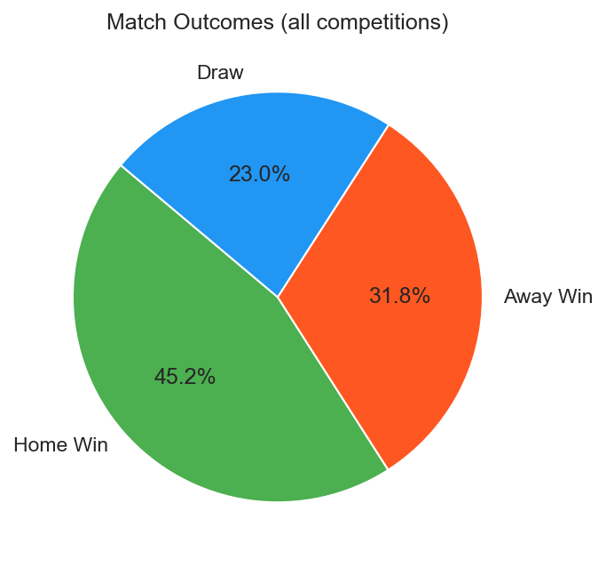

# Executive Summary

We propose building an automated data pipeline that ingests and transforms StatsBomb open football data into a unified analytics platform. The system will ingest, transform, and model player data using BigQuery, dbt, and Dagster, then apply unsupervised machine learning to identify player archetypes and analyze performance differences across club and international competition contexts. An LLM chatbot with BigQuery tool calling and a Looker Studio dashboard will serve as the end-user interfaces. Match outcome prediction using XGBoost is an optional stretch goal pursued only if the core pipeline and clustering work are complete ahead of schedule. The project is fully open-source, addresses the Trilemma Foundation's mission to deliver elite football analytics, and produces a reusable data product that can be extended to additional competitions and data sources.

# Introduction

## Problem

StatsBomb open data provides one of the richest available sources of European football match event data. However, no systematic, production-grade pipeline exists to transform this data into a unified analytical layer. The data is rich but fragmented across competitions, seasons, and event types, and currently inaccessible to analysts who cannot write complex SQL against nested JSON structures.

## Objectives

The project addresses three specific objectives for the Trilemma Foundation:

1. **Data integration**: build a production-grade ELT pipeline that ingests, cleans, and models StatsBomb data into analytics-ready tables with automated testing and documentation.
2. **Player analytics**: identify player archetypes using unsupervised clustering (PCA + K-Means) on per-90 event profiles, analyze how performance metrics shift between club and national team contexts, and optionally analyze match outcome prediction.
3. **Accessible insights**: deliver two complementary products. A Looker Studio dashboard for visual exploration and a Django-based LLM chatbot for natural language queries, so that analysts can interact with the unified dataset without writing SQL.

## Research Questions

The following questions guide the analytical work. Questions 1–3 are core deliverables and question 4 is optional and will be pursued only if time permits after the core work.

1. **How does player role distribution differ across competitions and positions?** Analyze per-90 event distributions segmented by competition and position to characterize how tactical roles manifest across leagues.

2. **What player archetypes exist across European football?** Apply PCA + K-Means to per-90 event profiles (goals, xG, passes, pressures, tackles, carries) to identify tactical styles such as "pressing forward", "creative playmaker", and "defensive anchor".

3. **How do players perform differently in club vs. national team settings?** Using the `is_international` flag in the StatsBomb match metadata, compare per-90 metrics (xG, shots, passes, pressures, carries, pass completion) for players who appear in both club competitions and international tournaments. Identify which metrics shift systematically across contexts and which positions are most affected.

4. **(Optional) Can match outcomes be predicted from tactical and form features?** Train calibrated models (logistic regression baseline, then Random Forest, then XGBoost) using rolling match-level inputs such as recent xG, possession, pressing intensity, head-to-head record, and home/away. Evaluate with Brier score and calibration against a naive baseline.

## Final Data Product

The deliverable is a fully automated pipeline orchestrated by Dagster OSS, running on a GCP Compute Engine VM. When new data arrives, the pipeline ingests, transforms (via dbt on BigQuery using native dagster-dbt integration), retrains ML models (threshold-based), and updates the Looker Studio dashboard automatically via its native BigQuery connection. The entire system is fully automated with no manual steps.

# Data & Exploratory Data Analysis

## Data Sources

The project is built on the StatsBomb open dataset, described in @tbl-sources. Exploratory work queries `events.parquet` and `lineups.parquet` in place with DuckDB (large files stay on disk).

| Source | Key tables | Event & player scale | Primary grain |
|--------|------------|----------------------|---------------|
| StatsBomb (open data, `statsbombpy` API) | matches, events, lineups, 360° tracking | 3,464 matches; ~12.2M event rows; 165,820 lineup rows; 10,808 distinct players; ~15.6M 360° frames | One `events` row = one on-ball action; one `lineups` row = one player appearance in a match |

: Data source overview. {#tbl-sources}

## Key EDA Findings

**Event data.** The `events` table contains about 12.2M rows with a wide schema (112 columns in the export). Action types are dominated by Pass (~3.4M), Ball Receipt (~3.2M), Carry (~2.6M), and Pressure (~1.1M). There are 88,023 Shot events with non-null StatsBomb xG, with mean xG per shot of 0.107.

**Player and lineup data.** The `lineups` table has 165,820 rows, 10,808 unique players, 308 teams, and 25 distinct `position_name` values. Missing `position_name` occurs in 34,179 rows and missing substitution `to_time` in 110,917 rows—consistent with bench players, unclear roles, or starters who are not substituted.

**Match-level context and quality.** Competition coverage is uneven: La Liga contributes 868 matches across full seasons, while the Champions League includes scattered single-match history. Match outcomes show a familiar home skew (≈45% home wins, 29% away, 26% draws). @fig-match-outcomes illustrates this distribution for the matches in our local extract.

::: {#fig-match-outcomes fig-pos="H"}

{width=55% fig-align="center"}

Distribution of match outcomes (home win, away win, draw) across all competitions in the StatsBomb extract used for exploratory analysis.

:::

```{=latex}
\FloatBarrier
```

## Data Inclusion Rules

To ensure statistical reliability, we propose the filtering thresholds in @tbl-rules. These will be discussed and confirmed with the partner.

| Rule | Threshold |
|------|-----------|
| Minimum matches per team per season | 10 |
| Minimum player minutes per season (for clustering) | 450 (approx. 5 full matches) |
| Season cutoff | 2000 onwards |

: Proposed data inclusion rules. {#tbl-rules}

# Data Science Approach

## Baseline and Progression

We adopt a layered approach, starting simple:

**Layer 1 — ELT Pipeline (dbt on BigQuery).** Raw data flows from the StatsBomb API through GCS into BigQuery. dbt transforms raw tables through staging (cleaning, type casting), intermediate (aggregation, joins, rolling averages), and mart layers (analytics-ready tables). Incremental materialization handles the ~12.2M-row events table. dbt tests gate the pipeline: null checks, uniqueness, and referential integrity.

**Layer 2 — Unsupervised ML (PCA + K-Means).** Player event profiles (per-90 normalized goals, assists, xG, pressures, tackles, carries) are reduced via PCA and clustered to identify tactical archetypes (e.g., pressing forwards, creative playmakers, defensive anchors). A separate club-vs-national analysis splits each player's record by the `is_international` match flag and compares per-90 metric shifts across both contexts. This directly addresses research questions 1, 2, and 3.

**Layer 3 *(optional)* — Supervised ML (XGBoost).** Using match-level features (rolling 5-match xG, possession, pressing intensity, head-to-head record, home/away), we train a logistic regression baseline, then Random Forest, then XGBoost. Training code is developed in Databricks Free Edition notebooks and exported as production scripts run by Dagster. Retraining triggers automatically when 50+ new matches accumulate.

**Layer 4 — LLM Chatbot with Tool Calling.** The chatbot queries BigQuery marts live. The Groq-hosted LLM (Llama 3 8B, free tier) is given a `query_bigquery` tool definition describing the mart table schemas. When a user asks a question, the LLM generates SQL, Django executes it against BigQuery, and the LLM summarizes the result set in natural language. This approach is always fresh (queries live data), more accurate (no retrieval errors), and simpler (no FAISS, no sentence-transformers, no index rebuild step).

## Anticipated Challenges

**StatsBomb coverage unevenness.** Competitions vary widely in sample size (868 La Liga matches vs. scattered Champions League entries). The club-vs-national analysis (RQ 3) is directly supported by the `is_international` flag and does not require full competition coverage. Uneven coverage may affect generalisation, and the data inclusion rules filter out fragmentary entries. 

**Player clustering stability.** Cluster assignments may shift between pipeline runs as new match data accumulates. Archetype labels in `seeds/cluster_labels.csv` require periodic human review to remain interpretable.

# Evaluation & Success Criteria

| Component | Metric | Success Threshold |
|-----------|--------|-------------------|
| ELT / marts | dbt test pass rate | 100% on every pipeline run (staging, uniqueness, referential checks) |
| Player clustering (RQ 2) | Silhouette score | > 0.3 (meaningful separation, clustering uses ≥ 450 min per player-season as in @tbl-rules) |
| LLM chatbot | Query accuracy | LLM-generated SQL returns correct results on > 80% of curated test queries |
| Match prediction *(optional, RQ 4)* | Probabilistic quality | Brier score < 0.60 vs. naive uniform baseline (~0.67), calibration curve shows predicted probabilities aligned with observed outcome frequencies |

: Evaluation metrics and success criteria. {#tbl-eval}

For the Trilemma Foundation, success means a working, documented, open-source pipeline that the organization can extend to additional leagues and seasons, a dashboard that surfaces player archetypes and tactical patterns at a glance, and a chatbot that lets analysts query the data conversationally.

# Timeline

| Week | Focus | Key Deliverables |
|------|-------|-----------------|
| 1 | Infrastructure + ingestion | GCP setup, Docker Compose on VM, Dagster asset definitions, dbt project init |
| 2 | dbt staging + intermediate | 3 staging models with tests, 6 intermediate models, data inclusion rules applied |
| 3 | dbt marts + clustering | 5 mart models, player clustering notebook, club-vs-national EDA; Databricks XGBoost baseline *(optional)* |
| 4 | ML completion + chatbot | Player cluster assignments, chatbot backend + Django integration; calibrated match predictions *(optional)* |
| 5 | Integration + dashboard | End-to-end pipeline test, Looker Studio (3 pages), CI/CD finalization |
| 6 | Polish + delivery | Documentation, demo video, open-source repo cleanup, final report |

: Six-week project timeline. {#tbl-timeline}
